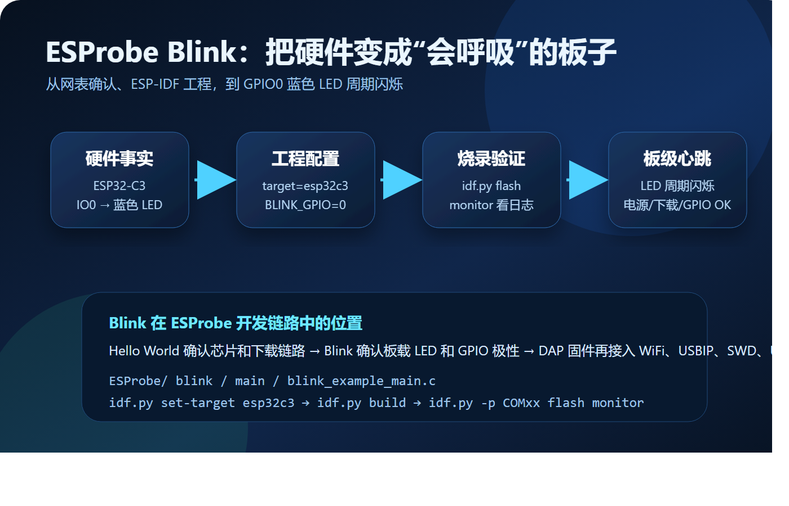

# 不要小看 Blink：ESProbe 的第一颗“心跳灯”

做一块调试器，最激动人心的时刻往往不是第一次跑通 OpenOCD，而是板子上那颗小小的 LED 按预期闪起来。

ESProbe 是一个基于 ESP32-C3 的无线 CMSIS-DAP 调试探针。它最终要通过 WiFi 把 USBIP 设备暴露给 PC，让 OpenOCD、Keil、IAR 等工具像使用普通 CMSIS-DAP 一样进行 SWD 调试。但在 USBIP、WinUSB、SWD 时序、UART TCP 桥接这些复杂模块之前，最应该先做的事情其实很朴素：

让板载 LED 闪起来。



## 为什么 Blink 值得单独写一篇

Blink 不是“入门玩具”，而是硬件 Bring-up 的第一道闸门。

对于 ESProbe 这样的板子，Blink 一次性验证了几件基础事实：

| 验证项 | 意义 |
| --- | --- |
| ESP32-C3 能启动 | 电源、Flash、启动配置基本正常 |
| ESP-IDF target 正确 | 工程确实按 `esp32c3` 编译 |
| Type-C 下载链路可用 | 后续固件迭代不会卡在烧录阶段 |
| GPIO 输出可控 | 板载 LED 网络和固件配置对齐 |
| 日志能正常输出 | `idf.py monitor` 能用于后续调试 |

这些事情看起来简单，但如果跳过它们，后面调 WiFi、USBIP 或 SWD 时，一旦出现异常，就很难判断问题来自协议、驱动、网络，还是最底层的硬件没有起来。

## ESProbe 的 LED 接在哪里

ESProbe 的主控是 ESP32-C3-WROOM-02-N4，板载蓝色 LED 连接在 GPIO0 上。这个设计在主固件里也被用作 WiFi 状态指示灯。

需要特别注意的是，很多板载 LED 并不是“GPIO 输出高电平点亮”。ESProbe 的 LED 由 3.3V 侧供电，GPIO0 下拉导通，因此它更接近低电平点亮的连接方式。

在 Blink 示例阶段，我们关心的不是效果多炫，而是先确认固件里的 `BLINK_GPIO` 与硬件事实一致。

## blink 示例项目结构

仓库里的 Blink 工程位于：

```text
blink/
├── CMakeLists.txt
├── sdkconfig.defaults
├── main/
│   ├── blink_example_main.c
│   ├── CMakeLists.txt
│   ├── Kconfig.projbuild
│   └── idf_component.yml
└── managed_components/
```

它来自 ESP-IDF 的标准 blink 示例，但保留在 ESProbe 仓库中后，就不只是示例代码，而是板级验证用例。

顶层 `CMakeLists.txt` 使用 ESP-IDF 标准工程结构，并开启 `MINIMAL_BUILD`：

```cmake
include($ENV{IDF_PATH}/tools/cmake/project.cmake)
idf_build_set_property(MINIMAL_BUILD ON)
project(blink)
```

这让工程只编译必要组件，适合做快速验证。

## 配置 Blink GPIO

Blink 示例通过 Kconfig 暴露了两个关键配置：

```text
CONFIG_BLINK_GPIO
CONFIG_BLINK_PERIOD
```

在 `main/Kconfig.projbuild` 中可以看到默认 GPIO 和闪烁周期配置。对 ESProbe 来说，重点是把 LED 引脚配置到 GPIO0：

```text
BLINK_GPIO=0
BLINK_PERIOD=1000
```

如果 LED 闪烁状态和日志里的 ON/OFF 语义相反，不要急着怀疑芯片坏了。先回到硬件连接，确认 LED 是否为低电平点亮。对嵌入式开发来说，“灯亮了”只是第一步，“灯为什么这样亮”才是真正有价值的结论。

## 主程序做了什么

`blink/main/blink_example_main.c` 的逻辑很清楚：

1. 根据配置选择普通 GPIO LED 或地址灯带。
2. 初始化 GPIO 输出。
3. 在 `while (1)` 中周期性切换状态。
4. 通过 `ESP_LOGI` 打印当前动作。

核心循环可以概括为：

```c
while (1) {
    ESP_LOGI(TAG, "Turning the LED %s!", s_led_state == true ? "ON" : "OFF");
    blink_led();
    s_led_state = !s_led_state;
    vTaskDelay(CONFIG_BLINK_PERIOD / portTICK_PERIOD_MS);
}
```

这段代码的价值不在算法，而在“每一次 GPIO 翻转都有日志对应”。如果串口日志在跑，但 LED 不闪，优先查 GPIO 和硬件连接；如果 LED 闪但没有日志，优先查 monitor、串口号或 USB Serial/JTAG。

## 构建和烧录

在 ESP-IDF 5.5.x PowerShell 环境中执行：

```powershell
cd <你的项目目录>\blink
idf.py set-target esp32c3
idf.py build
idf.py -p COMxx flash monitor
```

正常情况下，日志会周期性出现：

```text
I (xxxx) example: Turning the LED ON!
I (xxxx) example: Turning the LED OFF!
```

同时，ESProbe 板载蓝色 LED 按设定周期闪烁。

## Blink 和 ESProbe 主固件的关系

ESProbe 主固件要做的事情远比 Blink 复杂：

```text
WiFi STA 连接
mDNS 设备发现
TCP 3240 USBIP 服务
WinUSB / CMSIS-DAP v2 描述符
DAP 命令环形缓冲
SWD GPIO / SPI 时序
UART1 TCP 桥接
```

这些模块任何一个出问题，表面现象都可能只是“PC 端连不上”或“调试器不响应”。因此 Blink 的作用就是先给开发者一个底座：板子能启动、能下载、能输出、能控制 GPIO。

有了这颗“心跳灯”，后续调试才有方向感。

## 结语

Blink 是 ESProbe 的第一个可见反馈，也是从硬件设计走向固件系统的分界线。

当蓝色 LED 开始闪烁时，它证明的不只是一个 GPIO，而是整条基础开发链路已经闭合：

```text
硬件网表 → ESP-IDF 工程 → 编译 → 烧录 → 日志 → GPIO 输出
```

下一步，才值得把 WiFi、USBIP 和 CMSIS-DAP 一层层接上去。
