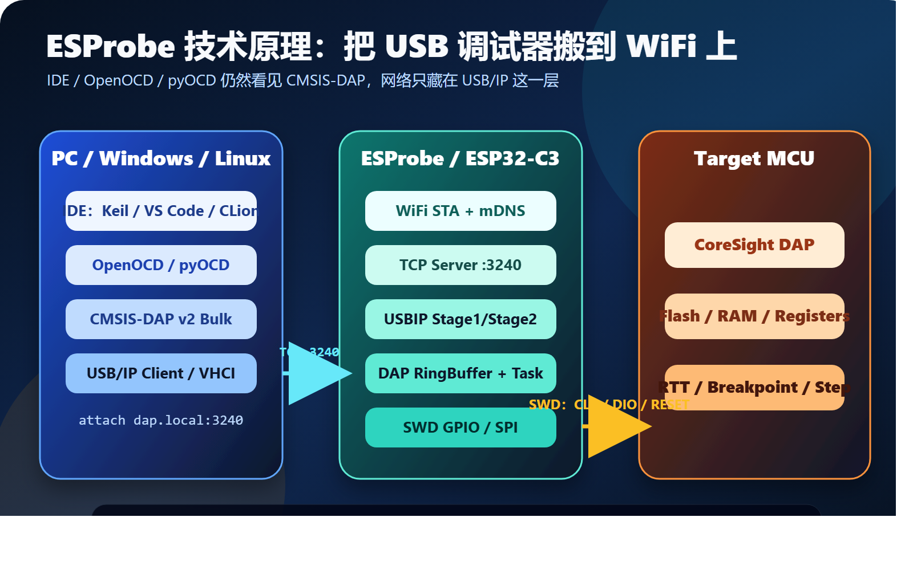

# ESProbe 技术原理：IDE 以为连着 USB，其实中间跑了一段 WiFi

ESProbe 的目标很直接：把一只基于 ESP32-C3 的小板子变成无线 CMSIS-DAP 调试探针。

但它真正有意思的地方，不是“ESP32-C3 会连 WiFi”，而是它选择了一条非常工程化的路径：

```text
不改 IDE，不改 OpenOCD，不发明私有调试协议。
让电脑仍然看到一个标准 CMSIS-DAP USB 设备。
只是这个 USB 设备，被 USB/IP 搬到了 WiFi 另一端。
```

这篇文章重点拆解 ESProbe 的技术原理，尤其是网络链路，以及它和 IDE、OpenOCD、pyOCD 这些工具之间的架构关系。



## 先看一句话架构

ESProbe 可以理解为三层桥接：

| 层级 | ESProbe 做的事 | 上层看到什么 |
| --- | --- | --- |
| 网络层 | ESP32-C3 连接 WiFi，监听 TCP 3240 | 一个 USB/IP 远端设备 |
| USB 层 | 用 USB/IP 模拟 USB 枚举和 URB 传输 | 一个 CMSIS-DAP v2 / WinUSB 设备 |
| 调试层 | 把 DAP 命令转换成 SWD 引脚时序 | 一只普通 CMSIS-DAP 探针 |

也就是说，ESProbe 不是让 OpenOCD 直接通过 TCP 控制 SWD 引脚，而是先让操作系统通过 USB/IP“挂载”一个虚拟 USB 设备。之后 OpenOCD、pyOCD 或 IDE 只需要按普通 CMSIS-DAP 设备来使用它。

## PC 端：IDE 并不知道 WiFi 的存在

在 PC 端，用户通常会使用三类工具：

```text
IDE：Keil、IAR、VS Code、CLion、Eclipse
调试服务：OpenOCD、pyOCD、probe-rs、厂商 GDB Server
底层探针协议：CMSIS-DAP、J-Link、ST-Link、FTDI 等
```

ESProbe 选择 CMSIS-DAP，是因为它是 Arm 生态中比较通用的调试探针协议。Arm 官方对 CMSIS-DAP 的定位，就是在主机调试软件和目标芯片 CoreSight Debug Access Port 之间提供标准化访问。

对 IDE 来说，真正交互的对象往往不是 ESProbe 本身，而是 OpenOCD 或 pyOCD：

```text
IDE / GDB 前端
    ↓
OpenOCD / pyOCD
    ↓
CMSIS-DAP 适配层
    ↓
操作系统中的 USB 设备
```

只要操作系统里出现了一个可用的 CMSIS-DAP v2 设备，上层工具链就可以沿用原来的工作方式。

这正是 ESProbe 的设计重点：网络化发生在 USB/IP 层，而不是强迫每个 IDE 都支持一种新的“WiFi DAP 协议”。

## 网络层：WiFi STA、静态 IP 和 mDNS

ESProbe 固件启动后，首先初始化 NVS、UART 桥、WiFi、DAP 核心和定时器。

在 `app_main()` 中，主要任务包括：

```text
wifi_init()
DAP_Setup()
timer_init()
mdns_setup()
tcp_server_task
DAP_Thread
uart_bridge_task
```

网络部分的核心在 `wifi_handle.c`：

- 使用 ESP32-C3 的 WiFi STA 模式连接路由器或热点。
- 支持多个 SSID 轮询，断线后自动切换。
- 关闭 WiFi 省电模式，降低交互延迟。
- 获取 IP 后点亮 WiFi 状态 LED。
- 默认支持 mDNS，主机名为 `dap.local`。

固件当前的 USB/IP 端口是：

```text
TCP 3240
```

这不是随便选的端口。USB/IP 生态中常用的服务端口就是 3240，因此 Windows 或 Linux 侧的 USB/IP 客户端更容易按标准方式连接。

对用户来说，典型连接目标是：

```text
192.168.137.123:3240
dap.local:3240
```

## TCP Server：先判断你说的是哪种协议

ESProbe 的 `tcp_server_task` 会创建 BSD socket，绑定端口，监听连接。

连接建立后，它先读取 4 字节 header，然后判断对端发来的是什么协议：

| Header 类型 | 含义 | 后续处理 |
| --- | --- | --- |
| USB/IP `OP_REQ_DEVLIST` | 主机请求设备列表 | 返回一个虚拟 USB 设备 |
| USB/IP `OP_REQ_IMPORT` | 主机请求导入设备 | 进入 URB 传输阶段 |
| elaphureLink 标识 | 兼容旧协议入口 | 进入 elaphureLink 处理 |
| 其他 | 未知协议 | 关闭连接 |

ESProbe 主线使用的是 USB/IP。连接断开时，固件会关闭 socket，并通知 DAP 任务重置状态，避免上一次连接残留的 DAP 响应污染下一次会话。

这点很重要。USB 调试链路是有时序和请求-响应关系的，如果网络断开后 ringbuffer 中还有旧响应，下一次 attach 可能会读到错包，导致主机端驱动或调试工具状态错乱。

## USB/IP：把 USB 设备“搬运”到网络上

USB/IP 可以分成两个阶段理解。

第一阶段是发现和导入：

```text
OP_REQ_DEVLIST  →  你有哪些 USB 设备？
OP_REQ_IMPORT   →  我要挂载 busid=1-1 的设备。
```

ESProbe 固件会返回一个设备列表，其中只有一个虚拟设备。它的 busid 是 `1-1`，设备描述符来自固件中的 USB descriptor。

第二阶段是 URB 传输。主机不再问“你有哪些设备”，而是开始像操作 USB 设备一样提交 URB：

| USB/IP Stage2 请求 | ESProbe 行为 |
| --- | --- |
| EP0 控制请求 | 返回设备、配置、字符串、Microsoft OS 2.0 描述符 |
| EP1 OUT | 接收 CMSIS-DAP 命令包 |
| EP1 IN | 返回 CMSIS-DAP 响应包 |
| UNLINK | 取消挂起 URB，清理等待队列 |

这就是 ESProbe 最关键的伪装：它没有真正的 USB 外设控制器连接到 PC，但它通过 USB/IP 回复了足够完整的 USB 行为，让 PC 端认为自己挂载了一个远端 USB 设备。

## 为什么是 CMSIS-DAP v2 / WinUSB

CMSIS-DAP 有两个常见 USB 传输形态：

| 版本 | USB 类型 | 特点 |
| --- | --- | --- |
| CMSIS-DAP v1 | HID | 免驱友好，但包和吞吐受限 |
| CMSIS-DAP v2 | Vendor-specific bulk / WinUSB | 更适合高速传输，pyOCD 和 OpenOCD 都支持 |

ESProbe 默认启用 `USE_WINUSB=1`，并把 DAP packet size 设置为 512 字节。固件还提供 Microsoft OS 2.0 描述符，目的是让 Windows 更容易把接口绑定到 WinUSB。

这对 OpenOCD 和 pyOCD 都很关键。它们并不需要知道 ESProbe 背后是 ESP32-C3，也不需要知道中间是 WiFi。它们只要能通过系统 USB 栈访问到 CMSIS-DAP bulk endpoint，就能发起 DAP 命令。

## DAP 命令如何穿过 ESProbe

一次典型的读内存、写寄存器或下载固件，会被拆成很多 CMSIS-DAP 命令包。

在 ESProbe 内部，数据路径大致是：

```text
USB/IP EP1 OUT
    ↓
handle_dap_data_request()
    ↓
dap_dataIN_handle ringbuffer
    ↓
xTaskNotifyGive(DAP_Task)
    ↓
DAP_ProcessCommand()
    ↓
dap_dataOUT_handle ringbuffer
    ↓
USB/IP EP1 IN fast_reply()
```

这里有两个任务在配合：

| 任务 | 优先级 | 职责 |
| --- | --- | --- |
| `tcp_server_task` | 14 | 处理 TCP、USB/IP、URB 收发 |
| `DAP_Task` | 10 | 执行 CMSIS-DAP 命令，驱动 SWD |

这种设计把网络收发和 DAP 执行拆开：TCP 任务负责尽快接包和回包，DAP 任务负责相对耗时的 SWD 事务。

## 从 CMSIS-DAP 到 SWD 引脚

CMSIS-DAP 命令进入 `DAP_ProcessCommand()` 后，会落到 CMSIS-DAP core 中的具体命令处理逻辑。

对于 ESProbe 当前目标，最重要的是 SWD：

```text
DAP 命令
    ↓
SW_DP.c
    ↓
GPIO bit-bang 或 SPI 加速
    ↓
GPIO6: SWCLK
GPIO7: SWDIO
GPIO2: nRESET
```

ESProbe 固件中 JTAG 当前是关闭的，主路径是 SWD。低速或协议切换阶段使用 GPIO bit-bang；高频数据传输阶段可以尝试通过 ESP32-C3 的 SPI 外设加速 SWD 波形。

从目标芯片角度看，它并不知道调试请求来自 WiFi。它只看到标准的 SWD 时序：SWCLK、SWDIO、nRESET。

## OpenOCD 在这条链路里的位置

OpenOCD 的角色是“调试服务器”和“适配器驱动集合”。

在 ESProbe 场景里，它通常位于 IDE/GDB 和 CMSIS-DAP 设备之间：

```text
GDB / IDE
    ↓ remote target
OpenOCD
    ↓ cmsis-dap adapter
ESProbe 虚拟 USB 设备
    ↓ USB/IP over WiFi
ESProbe 固件
    ↓ SWD
Target MCU
```

OpenOCD 负责理解目标芯片、Flash 算法、断点、寄存器、GDB remote protocol 等；ESProbe 负责把 CMSIS-DAP 命令变成 SWD 电气信号。

这意味着 ESProbe 不需要内置每一种 MCU 的烧录算法。目标芯片差异主要交给 OpenOCD 配置文件处理。

一个典型 OpenOCD 配置思路是：

```tcl
adapter driver cmsis-dap
transport select swd
adapter speed 4000
source [find target/xxx.cfg]
```

如果 Windows 已经通过 USB/IP 把 ESProbe attach 成 CMSIS-DAP v2 设备，OpenOCD 就按普通 CMSIS-DAP 探针使用它。

## pyOCD 在这条链路里的位置

pyOCD 更偏 Python 生态，常用于 Cortex-M 的烧录、调试、自动化测试和脚本化访问。

pyOCD 官方文档把 debug probe 定义为 pyOCD 和 target 之间的接口，并通过 probe driver 插件支持多种探针，其中包括 `cmsisdap`。它也明确区分了 CMSIS-DAP v1 HID 和 v2 bulk，通常会优先使用 v2。

在 ESProbe 场景里，pyOCD 的链路是：

```text
pyocd gdbserver / pyocd flash / Python API
    ↓
cmsisdap probe plugin
    ↓
操作系统 USB 栈中的 CMSIS-DAP v2 设备
    ↓
USB/IP client
    ↓
ESProbe over WiFi
    ↓
SWD target
```

pyOCD 的优势在于脚本化和自动化。如果你希望在 CI、产测脚本或 Python 工具里批量烧录、读取寄存器、做基础连通性测试，pyOCD 会比完整 IDE 更轻量。

## IDE、OpenOCD、pyOCD 和 ESProbe 的边界

可以把它们的职责边界这样记：

| 组件 | 负责什么 | 不负责什么 |
| --- | --- | --- |
| IDE | 用户界面、工程、断点操作 | 不直接处理 WiFi/USBIP |
| OpenOCD | GDB server、目标芯片、Flash、适配器驱动 | 不关心 ESProbe 内部 WiFi 实现 |
| pyOCD | Python 化调试/烧录、CMSIS-DAP probe 访问 | 不负责 ESProbe 的 TCP server |
| USB/IP client | 把远端 USB 设备挂到本机 USB 栈 | 不理解 CMSIS-DAP 语义 |
| ESProbe 固件 | USB/IP server、CMSIS-DAP core、SWD 引脚 | 不内置 IDE 和目标芯片工程逻辑 |

这个分工让系统具有可替换性：

- IDE 可以换，只要它能通过 GDB server 或 CMSIS-DAP 工作。
- OpenOCD 可以换成 pyOCD，只要目标芯片支持。
- Windows USB/IP 客户端可以换，只要它能正确 attach ESProbe。
- ESProbe 固件可以迭代网络和 SWD 性能，而不破坏上层工具链。

## 网络化带来的挑战

无线调试不是把 USB 线剪掉这么简单。ESProbe 需要面对几个网络化后的问题。

第一是时延。USB 调试器原本在本机 USB 总线上，往返延迟很低；WiFi 加 TCP 后，每个请求-响应都会多一层网络时延。因此固件中关闭 WiFi 省电、启用 `TCP_NODELAY`，都是为了减少交互延迟。

第二是队列同步。主机可能预先提交 IN URB，也可能在超时后发送 UNLINK。ESProbe 需要保存待回复的 IN header，并在 DAP 响应准备好后匹配回去；连接断开或取消时还要清理状态。

第三是包大小和吞吐。WinUSB bulk 512 字节包比 HID 更适合传输 DAP 命令，但 WiFi 仍然不是 USB 高速总线。因此 ESProbe 把 USB 速度上报为 Full Speed，并在固件里围绕 512 字节 DAP packet 做处理。

第四是发现和连接体验。静态 IP 简单可靠，mDNS 的 `dap.local` 更方便用户记忆。实际产品化时，还可以继续做配网、设备列表、Web 配置页等体验优化。

## 为什么不直接做一个 OpenOCD TCP Adapter

理论上，ESProbe 可以设计成“OpenOCD 直接连 ESP32-C3 的 TCP 服务，然后发送私有命令”。这样固件可能更简单。

但代价也很明显：

```text
每个工具都要适配私有协议
Windows IDE 很难直接复用
pyOCD 未必能原生支持
用户需要理解更多网络配置
生态兼容性变差
```

USB/IP 的好处是把网络层藏在操作系统 USB 栈下面。只要 attach 成功，后面的软件路径就回到了成熟的 CMSIS-DAP 生态。

ESProbe 的工程取舍是：底层实现更复杂一点，换取上层工具链更少改动。

## 总结

ESProbe 的核心不是“ESP32-C3 + WiFi + SWD”这几个关键词的简单相加，而是一套清晰的分层架构：

```text
IDE / GDB
    ↓
OpenOCD / pyOCD
    ↓
CMSIS-DAP v2
    ↓
USB/IP
    ↓
WiFi TCP 3240
    ↓
ESP32-C3 DAP 固件
    ↓
SWD
    ↓
Target MCU
```

它让网络调试尽量保持“上层无感”：IDE 仍然使用 OpenOCD 或 pyOCD，OpenOCD/pyOCD 仍然使用 CMSIS-DAP，只有 USB 设备本身被 USB/IP 延伸到了 WiFi 另一端。

这就是 ESProbe 最有价值的技术路线：用标准协议做无线化，而不是用私有协议重造整个调试生态。

## 参考资料

- Arm CMSIS-DAP: https://arm-software.github.io/CMSIS_6/main/DAP/index.html
- OpenOCD Debug Adapter Configuration: https://openocd.org/doc-release/html/Debug-Adapter-Configuration.html
- pyOCD Debug Probes: https://pyocd.io/docs/debug_probes.html
- ESProbe 固件：`fw/main/tcp_server.c`、`fw/main/usbip_server.c`、`fw/main/DAP_handle.c`
