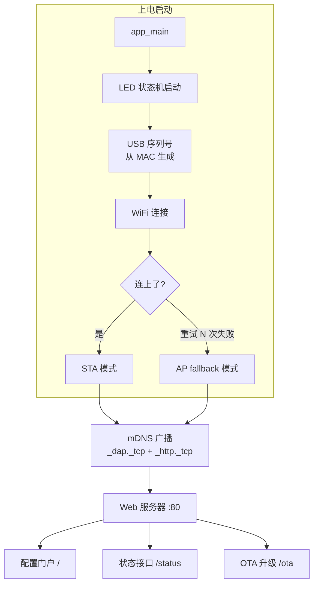
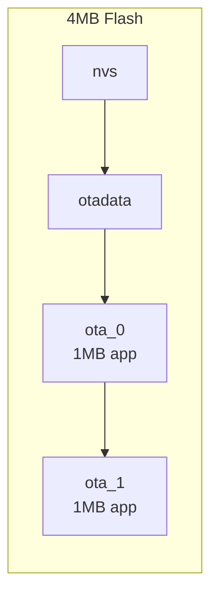
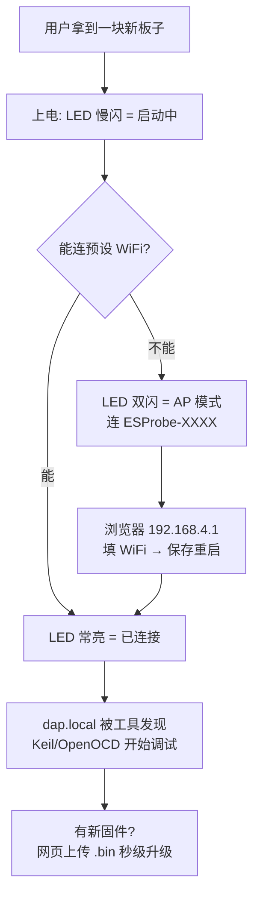

# 给无线调试器装上"大脑"：ESProbe 的一次固件进化

上一篇我们聊了 ESProbe 为什么在 Keil 下用 USBIP 会不稳定，以及 elaphureLink 这条更短的路。这一篇换个视角——不谈协议对抗，谈**产品化**。

一个能跑通 SWD 的 ESP32-C3 只是"能用"。要变成"好用"，还差几样东西：改 WiFi 得重新烧录、升级固件得插线、局域网里两个探针分不清谁是谁、板上那颗灯永远只会"亮"或"不亮"。

这次我们一口气补上了五个特性，让 ESProbe 从"一块能调试的板子"变成"一台有配置界面、能自我升级、可被发现的设备"。

---

## 先看一张改动全景图



这五个特性不是孤立的功能点，而是围绕一个核心问题展开：**如何让一台没有屏幕、没有按键阵列的嵌入式设备，具备完整的配置与维护能力？**

---

## 特性一：Web 配置门户——让改 WiFi 不再需要烧录

### 问题的根源

ESProbe 的 WiFi 凭证一直硬编码在 `wifi_configuration.h` 里，改个网络就得重新编译、重新烧录。这在开发阶段能忍，但作为产品是灾难。

上一轮我们已经加了 **NVS 凭证存储**和 **AP fallback 模式**（连不上就自己开热点），但当时留了个尾巴——存储层的 `wifi_config_store_save()` 写好了，却没有任何界面去调用它。用代码评审的话说，这是一段**死代码**。

这一轮就是来补上这最后一块拼图的。

### 方案：AP 模式下的配置网页

当 ESProbe 连不上预设 WiFi、进入 AP fallback 模式（SSID 形如 `ESProbe-A1B2`）后，用手机或电脑连上它，浏览器打开 `192.168.4.1`，就能看到一个配置页：

```
┌─────────────────────────┐
│  ESProbe Config         │
├─────────────────────────┤
│  WiFi                   │
│  [SSID____________]     │
│  [Password________]     │
│  [ Save & Reboot ]      │
├─────────────────────────┤
│  Status  {json...}      │
├─────────────────────────┤
│  Firmware Update (OTA)  │
│  [选择文件] [Upload]     │
└─────────────────────────┘
```

填入新的 SSID/密码，点击保存，固件把凭证写入 NVS 后自动重启，用新配置重连。整个过程不需要电脑上装任何工具，不需要串口，更不需要重新编译。

### 技术细节：为什么用 esp_http_server 而不是自己撸 socket

ESProbe 的 TCP 3240（USBIP/elaphureLink）和 1234（UART 桥）都是手写的 BSD socket 循环。但配置门户我们直接用了 ESP-IDF 自带的 `esp_http_server`：

| 维度 | 手写 socket | esp_http_server |
| --- | --- | --- |
| HTTP 解析 | 自己处理 method/header/body | 内置 |
| 路由 | 自己 if-else | `httpd_register_uri_handler` |
| 分块接收 | 自己管理缓冲 | `httpd_req_recv` |
| 维护成本 | 高 | 低 |

调试器的数据通道追求极致低延迟，值得手写优化；但配置门户是低频操作，稳定和省心比性能重要。**在合适的地方用合适的抽象**，这是工程判断。

表单提交用的是标准 `application/x-www-form-urlencoded`，固件里用 `httpd_query_key_value` 提取字段，再做一次 URL 解码（处理 `%XX` 和 `+`）。这样即使 WiFi 密码里有空格、`&`、中文，也能正确还原。

---

## 特性二：无线 OTA——升级固件不用再插线

### 从"单分区"到"双分区"

要支持在线升级，第一步是改分区表。ESProbe 原本用的是 ESP-IDF 默认的单 App 分区（`singleapp`）——整块 Flash 只有一个固件槽。想 OTA，就必须有第二个槽：写新固件的时候，旧固件还在运行。

我们切换到了 ESP-IDF 内置的 `two_ota` 分区表：



`otadata` 记录当前该从哪个槽启动。升级时写入空闲槽，成功后把启动指针指向它，重启即生效。如果新固件启动失败，还能回滚——这是双分区最大的价值：**升级失败不变砖**。

> 编译后实测：固件 918KB，单个 app 槽 1MB，剩余 10% 空间。刚好够用，也说明该给未来的功能留意体积了。

### 推还是拉？我们选了"推"

OTA 有两种典型模式：

- **拉（pull）**：设备主动去某个 URL 下载固件（`esp_https_ota`）。适合有固件服务器的量产场景。
- **推（push）**：用户把固件文件直接上传给设备（`esp_ota_ops`）。适合个人开发者、没有服务器的场景。

ESProbe 面向的是 DIY 玩家和小团队，没人会去架一台固件服务器。所以我们选了推模式——网页上选个 `.bin` 文件，点上传，浏览器用 `fetch` 把文件原始字节 POST 到 `/ota`：

```
浏览器 fetch(f) ──raw body──> POST /ota
                                  │
                          esp_ota_begin()
                                  │
                    循环 httpd_req_recv → esp_ota_write()
                                  │
                          esp_ota_end() 校验镜像
                                  │
                    esp_ota_set_boot_partition()
                                  │
                              重启生效
```

这里有个小技巧：没有用 multipart 表单上传（那需要在设备端解析 multipart 边界，很啰嗦），而是让浏览器直接把文件当作请求体裸传。设备端只管一段段收、一段段写 Flash，代码干净很多。

### ⚠️ 一个必须说清楚的坑

分区表从 `singleapp` 变成 `two_ota`，意味着 **Flash 布局彻底变了**。已经烧过旧固件的设备，**第一次必须用 USB 串口全量烧录这个新固件**，之后才能享受 OTA。而且 NVS 分区偏移也变了，旧的 WiFi 凭证会失效，需要重新配置。

这不是 bug，是分区表变更的固有代价。写文档时把它讲明白，比事后被用户追问"为什么 OTA 完就连不上了"要好得多。

---

## 特性三：状态接口——给设备一个"体检报告"

`GET /status` 返回一段 JSON：

```json
{
  "fw_version": "1.0.0",
  "mode": "sta",
  "ip": "192.168.137.123",
  "rssi": -52,
  "uptime_s": 3600,
  "partition": "ota_0",
  "usbip_port": 3240,
  "uart_port": 1234
}
```

别小看这几个字段。对无头设备来说，这是**唯一能一眼看清它状态**的窗口：

- `mode` 告诉你它现在是正常连着路由器（sta）还是掉线开了热点（ap）
- `rssi` 是信号强度——调试老掉线？先看这个是不是太弱
- `partition` 告诉你当前跑在哪个 OTA 槽，升级后可以确认是否切换成功
- `uptime_s` 能帮你发现"是不是偷偷重启过"

配置页顶部会自动 `fetch('/status')` 把它显示出来，也可以被监控脚本、自动化测试直接调用。

---

## 特性四：mDNS 元数据——让设备自我介绍

ESProbe 一直支持 `dap.local` 这个主机名。但这一轮我们让它广播得更"丰富"了——不只是"我在这"，而是"我是谁、我会什么"：

```
_dap._tcp   :3240   TXT: fw=1.0.0
                         device=ESProbe
                         proto=usbip+elaphurelink
                         uart_port=1234
_http._tcp  :80
```

`_dap._tcp` 声明了调试服务和它的能力（同时支持 USBIP 和 elaphureLink），`_http._tcp` 让配置门户能被 Bonjour、Avahi 这类工具自动发现。以后写一个上位机小工具扫一下局域网，就能列出所有 ESProbe 及其固件版本、支持的协议——不用记 IP，不用猜端口。

这就是服务发现的意义：**设备主动说清自己，而不是让用户去猜。**

---

## 特性五：MAC 序列号——让两个探针不再"撞脸"

原来 ESProbe 的 USB 序列号描述符是写死的 `"000000000000"`。一个还好，一旦局域网里挂两个 ESProbe，Windows 设备管理器里就是两个一模一样的 CMSIS-DAP，分不清谁是谁。

修复思路很巧妙：ESP32-C3 的 MAC 地址是 6 字节，转成十六进制正好 12 个字符，而 USB 序列号描述符里预留的正好是 12 个字符的位置（`0x1A` 字节 = 2 字节头 + 12 字符 × 2 字节 UTF-16）。**尺寸严丝合缝**，所以我们只需在启动时用 MAC 填充这个已有的描述符，不用改任何长度、不影响 `sizeof` 计算：

```c
// 6 MAC 字节 → 12 hex 字符，UTF-16LE
for (int i = 0; i < 6; i++) {
    serial[2 + (i*2)*2]   = hex[mac[i] >> 4];   // 高半字节
    serial[2 + (i*2+1)*2] = hex[mac[i] & 0xF];  // 低半字节
}
```

从此每个 ESProbe 都有全局唯一的序列号，比如 `A1B2C3D4E5F6`。多设备环境下终于能对号入座。

---

## 工程哲学：改动虽小，判断不少

回头看这五个特性，真正花心思的不是"怎么写代码"，而是一连串**取舍判断**：

| 决策点 | 选择 | 理由 |
| --- | --- | --- |
| 配置门户用什么 | esp_http_server | 低频操作，稳定 > 性能 |
| OTA 推还是拉 | 推（上传） | 面向个人开发者，无需服务器 |
| OTA 上传格式 | 裸 body 而非 multipart | 设备端解析成本低 |
| 分区表怎么改 | 内置 two_ota | 无需维护自定义 CSV |
| 序列号怎么生成 | 复用 MAC 填充现有描述符 | 尺寸刚好，零副作用 |

还有几个"顺手"的收尾：把上一轮评审指出的"设了没人读"的 `s_ap_mode_active` 变量，做成了 `wifi_is_ap_mode()` 访问器供状态接口调用——一个隐患变成了一个能力。

编译期还踩了两个小坑：`ESP_ERR_WIFI_NOT_CONNECTED` 其实叫 `ESP_ERR_WIFI_NOT_CONNECT`（少个 ED），以及 AP SSID 的 `strncpy` 触发了新版工具链的 `stringop-truncation` 告警——后者用带边界的 `memcpy` + 显式补 `\0` 解决。**新版 ESP-IDF 把更多告警升级成了错误，这其实是好事，逼你把边界情况写清楚。**

---

## 现在的 ESProbe 是什么样



从"必须连电脑、装工具、改代码、烧固件"，到"上电、连热点、填 WiFi、开调试"——ESProbe 终于有了一台成熟设备该有的样子。

下一步或许是 TLS 加密、连接认证，或者把 SPI 40MHz 加速用逻辑分析仪验证到底。但那是后话了。

---

## 相关链接

- ESProbe 固件 Web 服务实现：`fw/main/web_server.c`
- WiFi/AP fallback/NVS：`fw/main/wifi_handle.c`、`fw/main/wifi_config_store.c`
- mDNS 元数据：`fw/main/main.c` 的 `mdns_setup()`
- USB 序列号：`fw/components/USBIP/usb_descriptor.c`
- ESP-IDF OTA API：https://docs.espressif.com/projects/esp-idf/zh_CN/latest/esp32c3/api-reference/system/ota.html
- ESP-IDF HTTP Server：https://docs.espressif.com/projects/esp-idf/zh_CN/latest/esp32c3/api-reference/protocols/esp_http_server.html
