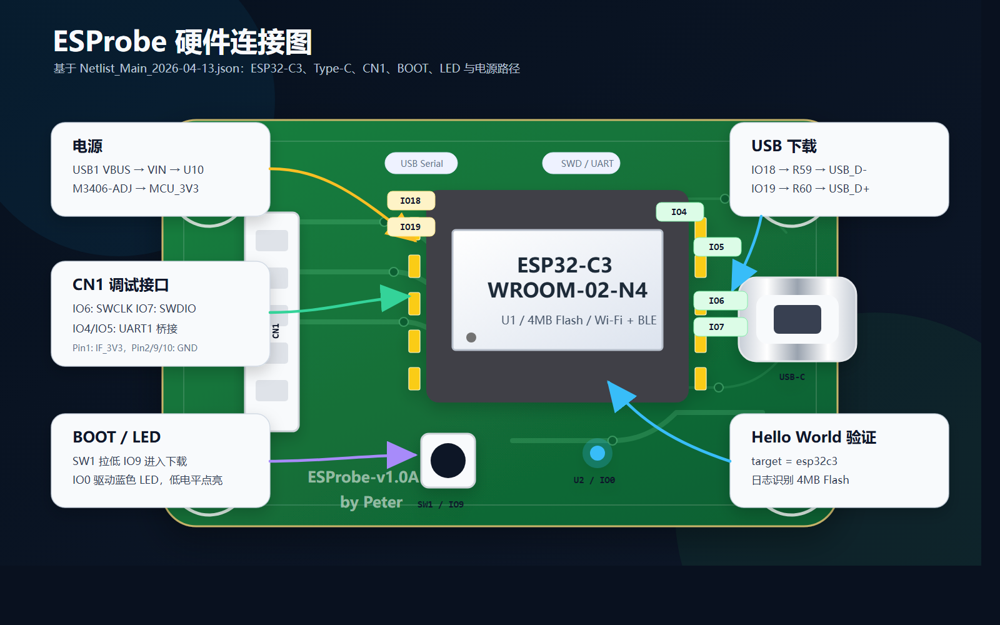

# 从硬件网表开始：用 ESP-IDF 5.5.x 点亮 ESProbe 的第一个 Hello World

做开源硬件，最容易被忽略的一步不是画板，也不是写代码，而是让硬件设计和固件工程在同一个事实基础上对齐。

ESProbe 是一个基于 ESP32-C3 的无线 CMSIS-DAP 调试探针。最终目标是通过 WiFi 把 USBIP 设备暴露给电脑，让 OpenOCD、Keil、IAR 这类标准调试工具在没有 USB 线直连目标板的情况下，也能通过 SWD 调试目标芯片。

不过在实现无线 DAP、USBIP、UART TCP 桥接之前，第一步应该很克制：先基于硬件网表，确认这块板子的主控、电源、下载、按键和外设引脚，然后用 ESP-IDF 5.5.x 跑通一个最小的 Hello World。

这篇文章记录的就是这个起点。

下面这张图是从 `hardware/Netlist_Main_2026-04-13.json` 提取关键信息后整理出的硬件 pinout 连接图。先看图，再看代码，会更容易理解为什么后面的 target、下载方式、BOOT 按键和 LED 极性要这样处理。



## 为什么从网表开始

原理图适合人看，网表适合固件开发时做核对。它直接描述“哪个器件的哪个引脚连到了哪个网络”，比凭记忆写 GPIO 更可靠。

ESProbe 仓库里的硬件网表位于：

```text
hardware/Netlist_Main_2026-04-13.json
```

从网表可以确认核心器件是：

```text
U1: ESP32-C3-WROOM-02-N4
厂商: ESPRESSIF 乐鑫
Flash: 4MB
供电: 3V ~ 3.6V
无线: 2.4GHz Wi-Fi + Bluetooth 5
```

也就是说，固件工程的目标芯片应该设置为 `esp32c3`，这会影响编译工具链、启动代码、分区、ROM 接口以及后续 GPIO/SPI/UART 驱动的实现方式。

## 硬件连接先过一遍

先看供电。Type-C 接口 `USB1` 的 VBUS 进入 `VBUS` 网络，经过电源路径后得到 `VIN`，再由 `U10 M3406-ADJ` 转换出 `MCU_3V3`，供给 ESP32-C3 模组。

网表里的关键连接如下：

```text
USB1.A4/A9/B4/B9 -> VBUS
U10.VIN          -> VIN
U10.SW/FB        -> DC-DC 输出反馈网络
U1.3V3           -> MCU_3V3
```

这说明 Hello World 阶段只要 Type-C 供电正常，ESP32-C3 就应该能启动。

再看下载和日志。ESP32-C3-WROOM-02-N4 的原生 USB 连接到了 Type-C：

```text
U1.IO18 -> R59 -> USB_D-
U1.IO19 -> R60 -> USB_D+
USB_D+ / USB_D- -> USB1
```

同时 UART0 也留了测试点：

```text
U1.TXD -> TXD0 -> TP3
U1.RXD -> RXD0 -> TP4
```

这意味着开发时可以优先通过 Type-C 使用 ESP32-C3 的 USB Serial/JTAG 下载和监视；如果需要排查底层启动日志，也可以从 TP3/TP4 接 UART 工具。

启动相关引脚也很关键：

```text
U1.EN  -> R10 10k 上拉到 MCU_3V3，C13 到地
U1.IO9 -> SW1 到 GND
U1.IO8 -> R12 10k 上拉到 MCU_3V3
```

ESP32-C3 进入下载模式通常需要控制启动绑定位。网表显示 IO9 接了按键，按住按键再复位，就可以配合下载流程使用。

最后是板上的指示灯：

```text
U1.IO0 -> U2 蓝色 LED 阴极
U2 阳极 -> R11 1.5k -> MCU_3V3
```

LED 是上拉到 3.3V、由 IO0 下拉点亮的连接方式。也就是说，后续如果写 blink 程序，`gpio_set_level(GPIO_NUM_0, 0)` 才是点亮，`gpio_set_level(GPIO_NUM_0, 1)` 是熄灭。Hello World 本身不需要控制 LED，但这个网表结论会影响后续验证程序。

## 调试接口 CN1

ESProbe 最终要做无线调试探针，所以 CN1 是最重要的外部接口。网表显示：

| CN1 引脚 | 网络 | ESP32-C3 引脚 | 计划用途 |
| --- | --- | --- | --- |
| 1 | IF_3V3 | 由 MCU_3V3 经保护器件输出 | 目标板参考电源 |
| 2 | GND | GND | 地 |
| 3 | IO4/ADC1_CH4/FSPIHD | IO4 | UART1 TX / TCP 串口桥 |
| 4 | IO5/ADC2_CH0/FSPIWP | IO5 | UART1 RX / TCP 串口桥 |
| 5 | IO6/FSPICLK | IO6 | SWCLK |
| 6 | IO7/FSPID | IO7 | SWDIO |
| 7 | IO2/ADC1_CH2/FSPIQ | IO2 | nRESET |
| 8 | IO10/FSPICS0 | IO10 | nTRST/TDI 预留 |
| 9 | GND | GND | 地 |
| 10 | GND | GND | 地 |

这个表会直接进入后续 DAP 固件的 `DAP_config.h`。但在 Hello World 阶段，我们先不碰这些高速和调试相关引脚，只验证最小启动链路。

## 创建 ESP-IDF 5.5.x Hello World 工程

开发环境使用 ESP-IDF 5.5.x。Windows 下可以打开 ESP-IDF PowerShell，或者手动加载环境：

```powershell
& 'C:\Espressif\tools\Microsoft.v5.5.3.PowerShell_profile.ps1'
```

进入项目目录后，创建或使用仓库中的 `hello_world` 工程：

```powershell
cd <你的项目目录>\hello_world
idf.py set-target esp32c3
idf.py build
```

这个工程结构很简单：

```text
hello_world/
├── CMakeLists.txt
└── main/
    ├── CMakeLists.txt
    └── hello_world_main.c
```

顶层 `CMakeLists.txt` 保持 ESP-IDF 工程标准写法：

```cmake
cmake_minimum_required(VERSION 3.16)

include($ENV{IDF_PATH}/tools/cmake/project.cmake)
idf_build_set_property(MINIMAL_BUILD ON)
project(hello_world)
```

`main/CMakeLists.txt` 注册主程序源文件：

```cmake
idf_component_register(SRCS "hello_world_main.c"
                       PRIV_REQUIRES spi_flash
                       INCLUDE_DIRS "")
```

主程序代码如下：

```c
#include <stdio.h>
#include <inttypes.h>
#include "sdkconfig.h"
#include "freertos/FreeRTOS.h"
#include "freertos/task.h"
#include "esp_chip_info.h"
#include "esp_flash.h"
#include "esp_system.h"

void app_main(void)
{
    printf("Hello world!\n");

    esp_chip_info_t chip_info;
    uint32_t flash_size;

    esp_chip_info(&chip_info);

    printf("This is %s chip with %d CPU core(s), %s%s%s%s, ",
           CONFIG_IDF_TARGET,
           chip_info.cores,
           (chip_info.features & CHIP_FEATURE_WIFI_BGN) ? "WiFi/" : "",
           (chip_info.features & CHIP_FEATURE_BT) ? "BT" : "",
           (chip_info.features & CHIP_FEATURE_BLE) ? "BLE" : "",
           (chip_info.features & CHIP_FEATURE_IEEE802154) ? ", 802.15.4 (Zigbee/Thread)" : "");

    unsigned major_rev = chip_info.revision / 100;
    unsigned minor_rev = chip_info.revision % 100;
    printf("silicon revision v%d.%d, ", major_rev, minor_rev);

    if (esp_flash_get_size(NULL, &flash_size) != ESP_OK) {
        printf("Get flash size failed");
        return;
    }

    printf("%" PRIu32 "MB %s flash\n",
           flash_size / (uint32_t)(1024 * 1024),
           (chip_info.features & CHIP_FEATURE_EMB_FLASH) ? "embedded" : "external");

    printf("Minimum free heap size: %" PRIu32 " bytes\n",
           esp_get_minimum_free_heap_size());

    for (int i = 10; i >= 0; i--) {
        printf("Restarting in %d seconds...\n", i);
        vTaskDelay(pdMS_TO_TICKS(1000));
    }

    printf("Restarting now.\n");
    fflush(stdout);
    esp_restart();
}
```

这里有两个细节值得保留。

第一，使用 `CONFIG_IDF_TARGET` 打印目标芯片。因为 ESProbe 的网表已经确认主控是 ESP32-C3，运行结果里应该看到 `esp32c3`。如果这里显示不对，说明工程 target 没有设置正确。

第二，使用 `esp_flash_get_size()` 打印 Flash 容量。ESP32-C3-WROOM-02-N4 是 4MB Flash 模组，运行日志应该能看到 4MB，这可以反向验证当前固件和硬件型号匹配。

## 烧录和串口监视

Type-C 插上 ESProbe 后，查看串口号：

```powershell
idf.py -p COMxx flash monitor
```

如果芯片没有自动进入下载模式，可以按住 BOOT 按键，也就是网表里的 `SW1 -> IO9 -> GND`，再触发复位或重新插入 USB。

正常运行时，日志应包含类似内容：

```text
Hello world!
This is esp32c3 chip with 1 CPU core(s), WiFi/BLE, silicon revision ...
4MB external flash
Minimum free heap size: ...
Restarting in 10 seconds...
```

到这里，第一阶段验证就完成了：

```text
Type-C 供电正常
ESP32-C3 可以启动
ESP-IDF 5.5.x 工程 target 正确
下载链路正常
日志输出正常
Flash 型号与硬件网表一致
```

## 为什么 Hello World 对这个项目重要

ESProbe 后续固件并不是普通的 WiFi 小工具。它要同时处理：

```text
WiFi STA 连接
mDNS 发现
USBIP TCP 服务
CMSIS-DAP 命令处理
SWD GPIO/SPI 时序
UART1 TCP 透传
```

这些模块一上来就全部打开，很难判断问题来自硬件、电源、下载、WiFi 还是协议栈。

Hello World 的价值就是把变量压到最低。只要这个最小程序能稳定启动，就说明板子的基础链路是成立的；后面再逐步加入 LED、WiFi、TCP、DAP，定位问题会清晰很多。

## 下一步

下一篇可以从网表中的 IO0 LED 开始，写一个真正贴合 ESProbe 硬件的 blink 程序：因为 LED 是低电平点亮，代码里要注意电平极性。

再往后，就可以把 CN1 的 IO6/IO7 接入 SWD，验证 GPIO bit-bang，再逐步切到 SPI 加速，为无线 CMSIS-DAP 固件打基础。

开源硬件项目的固件开发，不应该脱离原理图和网表。对 ESProbe 来说，第一个 Hello World 虽然简单，但它把“硬件确实是这块板”和“固件确实跑在这块板上”连接了起来。
