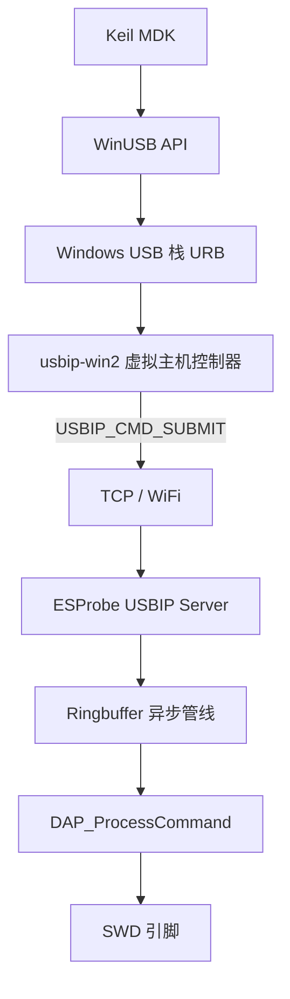
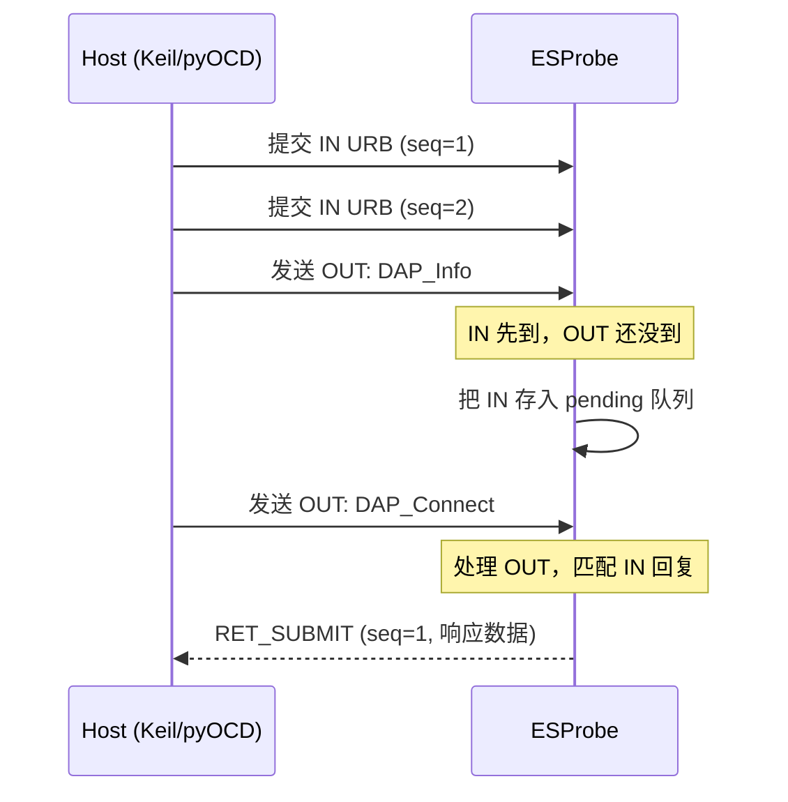
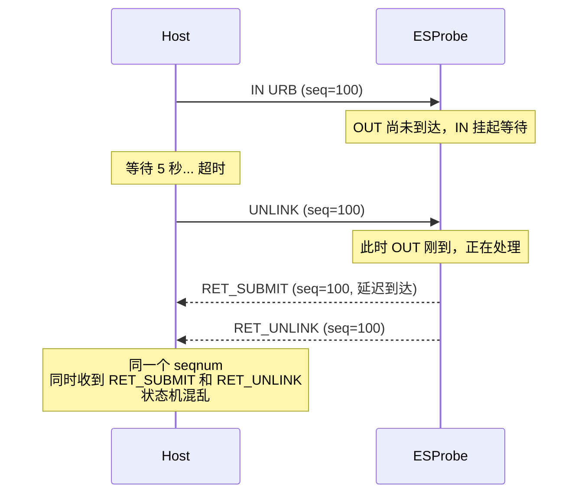
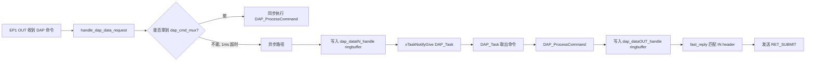

# 设备管理器绿灯亮了，Keil 却装看不见：USBIP 无线调试到底卡在哪一层？

你做过无线调试器，大概率经历过这个场景：

```text
usbip attach  →  成功
设备管理器    →  出现 CMSIS-DAP v2
Keil Debug Adapter 列表  →  空
pyOCD list    →  空
串口日志      →  满屏 unlink
```

设备管理器说"连上了"，Keil 说"不认识"。同一个 DAPLink 插物理 USB 口，一切正常。唯一的变量是"物理 USB"换成了"USB/IP 虚拟 USB"。

这道鸿沟，不在 USB 枚举，而在 URB 时序、驱动就绪时机和 USB/IP 客户端的脾气里。这篇文章把这条链路从上到下拆开，找出六个卡点，然后给出一个你可能没想到的答案——**绕过 USBIP**。

---

## 全景：从 Keil 到 SWD，一共隔了几层？

先看一条物理 DAPLink 的链路：

```text
Keil MDK → WinUSB → USB Host Controller → DAPLink → SWD
         2 层       硬件直连
```

再看 ESProbe 通过 USBIP 的链路：



物理 USB 是 **2 层**，USBIP 是 **6 层以上**。每多一层，就多一个超时阈值、一个状态机、一个竞争窗口。

问题不在于某一层写得不好，而在于**层与层之间的时序预期不匹配**。

---

## 第一层：URB 时序的跨层错配

这是最核心的问题。

### Keil 和 pyOCD 怎么用 WinUSB

CMSIS-DAP v2 使用 WinUSB bulk 端点（EP1 IN/OUT）。Keil 和 pyOCD 的 WinUSB 后端在初始化阶段会做一件事：**预提交多个 IN URB**。

"预提交"的意思是：主机还没发送任何 DAP 命令，就先向操作系统提交好几个"读取请求"（IN URB），让它们排着队，等设备有数据回来时立刻能接住。



在物理 USB 上，这完全不是问题——USB Host Controller 硬件调度，IN 和 OUT 的往返延迟在微秒级，预提交的 IN 几乎瞬间就能等到配对的 OUT。

### WiFi 上发生了什么

WiFi TCP 的往返延迟是 **1-10 毫秒**，是物理 USB 的 **100-1000 倍**。更要命的是延迟有抖动——WiFi 空闲时 1ms，忙时可能飙到 50ms。

当网络延迟抖动时，会出现这样的场景：



ESProbe 固件已经做了很多工作来处理这个问题——`pending_in_queue[]` 保存等待中的 IN header，`handle_dap_unlink()` 在收到 UNLINK 时从队列中移除对应 seqnum。但问题在于 **RET_SUBMIT 和 RET_UNLINK 的到达顺序无法控制**。如果 RET_SUBMIT 已经发出，随后才收到 UNLINK，主机端的 URB 跟踪状态就可能损坏。

这不是一个能靠"修一个 bug"解决的问题。它是 **USB 协议假设（微秒级延迟）** 和 **TCP/WiFi 现实（毫秒级延迟+抖动）** 之间的结构性矛盾。

---

## 第二层：WinUSB 管道的就绪时差

`usbip attach` 成功后，Windows 还需要完成一系列步骤：


| 设备类型 | 驱动就绪时间 | 原因 |
| --- | --- | --- |
| 物理 DAPLink（已安装过驱动） | < 1 秒 | 驱动已缓存，只需重新枚举 |
| USBIP 虚拟设备（每次 attach） | 10-30 秒 | 每次 attach = 全新设备插入，完整驱动安装流程 |

Keil 的 Debug Adapter 列表是一次性扫描——打开下拉菜单的那一刻，它遍历所有 WinUSB 设备。如果扫描发生在符号链接创建之前，ESProbe 就不在列表里。

这解释了一个常见现象：**attach 后等 10-30 秒再打开 Keil，识别率明显提高**。物理 DAPLink 不需要这个等待，因为驱动早就缓存好了。

---

## 第三层：配置描述符的分包发送

ESProbe 在回复 `GET_DESCRIPTOR(Configuration)` 时，有一个容易被忽略的实现细节：

```c
// usb_handle.c 中的逻辑
send_stage2_submit(header, 0, total_length);  // 告诉主机：total_length 字节来了
usbip_network_send(kSock, kUSBd0ConfigDescriptor, sizeof(...)); // 第一段
usbip_network_send(kSock, kUSBd0InterfaceDescriptor, ...);     // 第二段
```

`RET_SUBMIT` 头部声明的 `data_length` 是 `total_length`，但实际数据是分两次 TCP send 发出去的。

在物理 USB 上，Host Controller 用 DMA 一次性搬走整个描述符，不存在"分包"概念。但在 USBIP over TCP 上，如果 usbip-win2 对 payload 长度做严格校验——先读 RET_SUBMIT header 里的 `data_length`，然后尝试从 TCP 流中读取恰好这么多字节——两次 `send()` 之间如果有 TCP 层的分段延迟，可能导致**声明的长度与单次 recv 读到的字节数不匹配**。

设备管理器只读一次配置描述符就过关了，所以枚举看起来正常。但 pyOCD 和 Keil 在探测阶段会反复打开/关闭设备、多次读取描述符，分包问题被多次触发后，某一次的校验失败就可能导致设备被标记为"不可用"。

---

## 第四层：网络环境的隐形干扰

USBIP over WiFi 对网络环境极其敏感。上游项目 wireless-esp8266-dap 的 README 里有一段警告：

> *"This project is sensitive to the network environment. LAN broadcast packets (DropBox LAN Sync, Logitech Arx Control) can cause serious impact."*

WiFi 链路上的每一个问题都会直接转化为 URB 延迟：

| 网络事件 | 对 URB 的影响 |
| --- | --- |
| WiFi 空闲信道争用 | 延迟从 1ms 飙到 10-50ms |
| TCP 重传（丢包） | 单次重传增加 200ms+ |
| LAN 广播风暴 | 大量非业务包挤占带宽 |
| AMPDU 重排序 | 32 BA 窗口可能导致包到达顺序变化 |

物理 USB 的错误恢复是硬件级的——重试在微秒内完成，上层几乎无感知。WiFi TCP 的错误恢复是秒级的——一次 TCP 重传就可能触发 URB 超时，进而触发 UNLINK 风暴。

ESProbe 固件串口日志里那些密集的 `unlink`，大多就是这么来的。

---

## 第五层：Keil MDK 的版本门槛

Arm 官方文档记录了一个已知问题：**Keil MDK 5.28 及更早版本无法检测 CMSIS-DAP v2 设备**。CMSIS-DAP v2 依赖 WinUSB bulk 端点，而旧版 Keil 的设备扫描逻辑只认 HID 接口。

| Keil MDK 版本 | CMSIS-DAP v1 (HID) | CMSIS-DAP v2 (WinUSB) |
| --- | --- | --- |
| ≤ 5.28 | 正常 | **不识别** |
| ≥ 5.29 | 正常 | 正常 |

ESProbe 默认启用 `USE_WINUSB=1`，走的是 v2 路径。如果你的 Keil 版本较旧，即使 USBIP 完全正常，Keil 也看不见设备。

另外，Keil 要求 USB 接口字符串包含 "CMSIS-DAP" 才会将其识别为调试器。ESProbe 的 `kInterfaceString` 已经满足这个要求，但 Keil 对描述符的顺序和 `bInterfaceClass` 值也有偏好——`0xFF`（Vendor Specific）配合 WinUSB 是正确组合，但如果 MS OS 2.0 描述符的注册过程因 USBIP 延迟而不完整，Keil 可能拒绝识别。

---

## 第六层：异步管线的复杂度税

USBIP 路径在 ESProbe 内部使用了一套异步管线：



这条路径涉及：2 个 ringbuffer、1 个互斥量（`dap_cmd_mux`）、1 个信号量（`data_response_mux`）、1 个任务通知、1 个 pending IN 队列（最多 4 条）。

同步快速路径（`handle_dap_data_request` 中尝试获取 `dap_cmd_mux`）能在 1ms 内拿到锁时直接执行，省去异步开销。但当 DAP_Task 正在处理上一条命令时，新来的 OUT 只能走异步路径，增加一次 ringbuffer 入队/出队和任务切换的开销。

这不是设计问题——在物理 USB 上，这套异步管线完全够用。但在 WiFi 上，每一个微秒的额外延迟都在挤压 URB 超时的余量。

---

## 六层困局的本质

把六个问题放在一起看：

| 层级 | 物理 USB | USBIP over WiFi | 差距 |
| --- | --- | --- | --- |
| URB 往返延迟 | 10-100 μs | 1-10 ms | 100-1000× |
| IN/OUT 配对 | 硬件即时 | pending 队列 + 竞争窗口 | 有竞争条件 |
| 驱动就绪 | < 1s（缓存） | 10-30s（每次全新） | 10-30× |
| 描述符传输 | DMA 原子操作 | TCP 分段，可能分包 | 有校验风险 |
| 网络干扰 | 无 | WiFi 抖动/丢包/广播 | 不可控 |
| 内部管线 | 同步即可 | 异步 ringbuffer + mutex | 有额外开销 |

**本质矛盾**：USB 协议设计在微秒级延迟、零丢包、硬件调度的假设上。WiFi TCP 提供的是毫秒级延迟、可能丢包、软件调度。USBIP 试图用后者模拟前者，每一层不匹配都是一个潜在的故障点。

这不是"修一个 bug"能解决的——这是架构层面的阻抗不匹配。

---

## 转机：elaphureLink 已经在你固件里

说了这么多 USBIP 的问题，现在说一个可能被忽略的事实：

**ESProbe 固件已经内置了 elaphureLink 支持，不需要 USBIP 就能直接和 Keil 通信。**

看 [tcp_server.c](../fw/main/tcp_server.c) 的协议路由逻辑：

```c
header = ntohl(*((int *)(tcp_rx_buffer)));

if (header == EL_LINK_IDENTIFIER) {       // 0x8a656c70
    el_dap_work(tcp_rx_buffer, sizeof(tcp_rx_buffer));
} else if ((header & 0xFFFF) == 0x8003 ||
           (header & 0xFFFF) == 0x8005) {  // USBIP
    usbip_worker(tcp_rx_buffer, sizeof(tcp_rx_buffer), &usbip_state);
}
```

同一个 TCP 3240 端口，固件根据前 4 字节自动判断协议类型：USBIP 请求走 USBIP 路径，elaphureLink 请求走 elaphureLink 路径。**不需要改固件，不需要重新编译，只需要在 PC 端换一个工具。**

---

## elaphureLink 是什么

elaphureLink 是专门为 Keil µVision 设计的 CMSIS-DAP 网络调试方案。它的核心理念很简单：

```text
不模拟 USB 设备，不安装 Windows 驱动。
Keil 直接通过 TCP 连接 ESProbe，发送 CMSIS-DAP 命令。
```

### 架构对比

```mermaid
flowchart TB
    subgraph USBIP 路径
        A1[Keil] --> B1[WinUSB API]
        B1 --> C1[Windows USB 栈]
        C1 --> D1[usbip-win2 UDE 驱动]
        D1 --> E1[TCP]
        E1 --> F1[ESProbe USBIP Server]
        F1 --> G1[Ringbuffer 异步管线]
        G1 --> H1[DAP_ProcessCommand]
    end

    subgraph elaphureLink 路径
        A2[Keil] --> B2[elaphureLink AGDI]
        B2 --> C2[elaphureLink RDDI]
        C2 --> D2[elaphureLink Proxy]
        D2 --> E2[TCP]
        E2 --> F2[ESProbe el_dap_work]
        F2 --> G2[DAP_ExecuteCommand 同步]
    end
```



| 对比项 | USBIP 路径 | elaphureLink 路径 |
| --- | --- | --- |
| 抽象层数 | 6+ 层 | 3 层 |
| Windows 驱动 | WinUSB.sys + usbip-win2 UDE | 无（用户态 DLL） |
| 设备枚举 | 每次 attach 全新枚举 | 无枚举，TCP 直连 |
| URB 生命周期 | submit / unlink / timeout / retry | 无 URB，简单请求-响应 |
| IN/OUT 竞争 | 有（预提交 IN URB） | 无（同步请求-响应） |
| DAP 命令路径 | 异步 ringbuffer + mutex + task notify | 同步 DAP_ExecuteCommand() |
| 连接启动时间 | 10-30 秒（驱动安装） | < 1 秒（TCP 握手） |
| 失败模式 | 状态机损坏，管道死亡 | 干净断开，可重连 |

### 为什么 elaphureLink 更稳定

elaphureLink 在 ESProbe 固件中的实现极其简洁。看 [elaphureLink_protocol.c](../fw/components/elaphureLink/elaphureLink_protocol.c) 的核心数据处理函数：

```c
void el_dap_data_process(void* buffer, size_t len) {
    int res = DAP_ExecuteCommand(buffer, (uint8_t *)el_process_buffer);
    res &= 0xFFFF;
    usbip_network_send(kSock, el_process_buffer, res, 0);
}
```

收到命令 → 执行 → 发回响应。没有 ringbuffer，没有任务通知，没有互斥量竞争，没有 IN/OUT 配对。一个干净的同步循环。

这并不意味着 elaphureLink 没有延迟——WiFi 的物理延迟依然存在。但它消除了 USBIP 引入的所有**额外复杂度**：没有 URB 超时、没有 UNLINK 竞争、没有驱动安装等待、没有描述符校验风险。

WiFi 延迟在这里只是让调试慢一点，而不是让调试坏掉。

---

## 实践指南：三步切换到 elaphureLink

### 第一步：下载 elaphureLink

从 GitHub Releases 下载 `elaphureLink.Wpf`：

> https://github.com/windowsair/elaphureLink/releases

解压后直接运行 `elaphureLink.Wpf.exe`，无需安装。需要 .NET Framework 4.7.2（Windows 10/11 通常已自带）。

### 第二步：安装 AGDI 驱动

在 elaphureLink GUI 中点击"Install Driver"，它会注册 Keil µVision 的 AGDI 调试接口插件。这一步只需执行一次。

### 第三步：连接 ESProbe

在 elaphureLink 中输入 ESProbe 的地址：

```text
192.168.137.123:3240
或
dap.local:3240
```

点击 Connect。然后在 Keil 中：

```text
Project → Options for Target → Debug
→ 下拉选择 "elaphureLink"
→ Settings → 确认连接状态
```

固件不需要任何修改——同一个 3240 端口同时服务 USBIP 和 elaphureLink。

---

## 什么时候用 USBIP，什么时候用 elaphureLink

| 场景 | 推荐方案 | 原因 |
| --- | --- | --- |
| Keil MDK 调试 | **elaphureLink** | 稳定，无驱动，快速连接 |
| OpenOCD 调试 | USBIP | OpenOCD 的 cmsis-dap 适配层走 WinUSB |
| pyOCD 调试 | USBIP | pyOCD 的 cmsisdap 后端走 WinUSB |
| IAR 调试 | USBIP | IAR 使用 CMSIS-DAP v2 USB 设备 |
| VS Code + Cortex-Debug | USBIP | 依赖 OpenOCD/pyOCD |
| 批量烧录脚本 | USBIP 或 elaphureLink | 取决于脚本用 pyOCD 还是 Keil 命令行 |

简单记：**Keil 用 elaphureLink，其他用 USBIP**。

---

## 那些密集的 unlink 告诉我们什么

回到文章开头的现象——串口日志里满屏的 `unlink`。这些 unlink 是症状，不是病因。

病因是 USBIP 在 WiFi 上运行时，URB 的超时-重试-取消机制被网络延迟反复触发。每一次 unlink 都意味着一个 URB 被提交后超时取消，而超时的根源不在 ESProbe 固件，不在 usbip-win2 实现，而在于**用毫秒级延迟的网络去模拟微秒级延迟的 USB 总线**这个架构选择本身。

elaphureLink 的价值不是"修好了 USBIP 的 bug"，而是**换了一条不经过 USB 模拟的路径**。它让 Keil 直接和 CMSIS-DAP 命令处理器对话，跳过了 USB 枚举、WinUSB 驱动、URB 生命周期这一整套为物理 USB 设计的机制。

有时候，最好的修复不是修 bug，而是换一条路。

---

## 结语

USBIP 是一个了不起的协议——它让 USB 设备可以在网络上流动，让 ESProbe 这样的无线探针成为可能。但"可以"和"好用"之间，隔着 USB 协议四十年的硬件假设。

ESProbe 的固件同时支持两条路径：USBIP 为 OpenOCD、pyOCD、IAR 等 USB 生态工具服务；elaphureLink 为 Keil 用户提供一条更短、更稳的直达通道。同一个 TCP 3240 端口，固件自动识别协议类型，用户不需要切换固件。

如果你之前用 USBIP + Keil 反复遇到不稳定的问题，试试 elaphureLink。固件已经就绪，你只需要换一个 PC 端工具。

---

## 参考资料

- elaphureLink 项目：https://github.com/windowsair/elaphureLink
- elaphureLink Releases：https://github.com/windowsair/elaphureLink/releases
- wireless-esp8266-dap（上游项目）：https://github.com/windowsair/wireless-esp8266-dap
- usbip-win2：https://github.com/vadimgrn/usbip-win2
- usbip-win：https://github.com/cezanne/usbip-win
- Arm CMSIS-DAP 文档：https://arm-software.github.io/CMSIS_6/main/DAP/index.html
- Keil MDK CMSIS-DAP 检测问题：https://developer.arm.com/documentation/ka003663/latest/
- ESProbe 固件 USBIP 实现：`fw/main/usbip_server.c`、`fw/main/DAP_handle.c`
- ESProbe 固件 elaphureLink 实现：`fw/components/elaphureLink/elaphureLink_protocol.c`
- ESProbe 固件协议路由：`fw/main/tcp_server.c`
