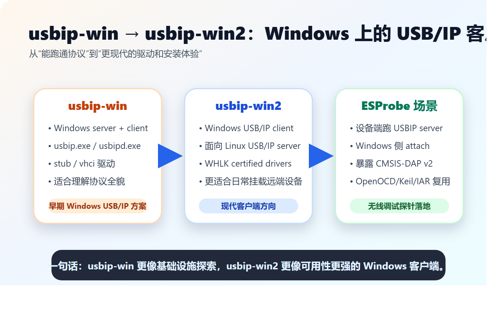

# 从 usbip-win 到 usbip-win2：Windows 上的 USB/IP 客户端为什么重要

如果说 ESProbe 的硬件目标是“把调试线变成无线”，那么它的软件目标就是“让电脑相信，远端网络里真的插着一个 USB 调试器”。

这件事背后的关键技术叫 USB/IP。

USB/IP 的思路很直接：把 USB 请求封装进 TCP/IP，在网络两端分别模拟 USB 主机和 USB 设备。对上层调试工具来说，它看到的仍然是一个 USB 设备；对底层链路来说，数据已经从一根 USB 线变成了一条网络连接。

在 Windows 生态中，`usbip-win` 和 `usbip-win2` 是理解这条链路绕不开的两个项目。



## USB/IP 解决的到底是什么问题

传统 USB 的物理边界很清晰：设备插在哪台电脑上，就由哪台电脑使用。

但嵌入式开发经常希望打破这个边界：

- 开发板在远处，调试工具在本机。
- 设备接在实验台电脑上，工程师在另一台机器上操作。
- Windows 上运行 IDE，但 USB/IP server 在 Linux 或嵌入式设备上。
- 像 ESProbe 这样的无线探针，本身就是“通过网络出现的 USB 设备”。

USB/IP 的价值，就是让 USB 设备从“本地外设”变成“网络资源”。

## usbip-win：Windows 上的早期基础设施

`usbip-win` 的目标是让 Windows 支持 USB/IP。它同时覆盖 server 和 client 两个方向：

| 组件 | 作用 |
| --- | --- |
| `usbipd.exe` | Windows 侧 USB/IP daemon |
| `usbip.exe` | 命令行客户端工具 |
| `usbip_stub` | 把本地 USB 设备导出给远端 |
| `usbip_vhci` | 在 Windows 上模拟虚拟 USB Host Controller |

这类项目最难的地方不在 TCP socket，而在 Windows 驱动模型。要让远端 USB 设备真正被 Windows 识别，必须有虚拟主机控制器、设备枚举、URB 转发、驱动签名等一整套机制。

因此，`usbip-win` 更像是 Windows USB/IP 的“地基工程”。它让开发者能看到协议从用户态工具到内核驱动的完整形态。

## usbip-win2：更聚焦的 Windows USB/IP 客户端

`usbip-win2` 可以看作是面向实际使用进一步演进的方向。它更聚焦于 Windows USB/IP client，也就是让 Windows 去连接远端 USB/IP server。

这正好贴近 ESProbe 的典型使用方式：

```text
ESProbe 固件作为 USB/IP server
Windows 电脑作为 USB/IP client
Windows 工具链识别出 CMSIS-DAP v2
OpenOCD / Keil / IAR 正常使用
```

与早期项目相比，`usbip-win2` 的亮点包括：

| 项目 | 特点 |
| --- | --- |
| 协议兼容 | 面向标准 USB/IP 协议 |
| 客户端定位 | 主要解决 Windows 挂载远端 USB 设备 |
| 驱动体验 | 提供更现代的驱动和安装路径 |
| 生态衔接 | 适合与 Linux USB/IP server 或嵌入式 USB/IP server 配合 |

换句话说，如果你只是想在 Windows 上使用远端 USB/IP 设备，`usbip-win2` 往往比研究完整 server/client 双向实现更直接。

## ESProbe 为什么关心 Windows USB/IP 客户端

ESProbe 固件在 ESP32-C3 上实现了 USBIP-over-TCP。它监听 TCP 3240 端口，对外暴露一个 CMSIS-DAP v2 / WinUSB 设备。

Windows 侧完成 attach 后，数据路径大致如下：

```text
OpenOCD / Keil / IAR
        ↓
Windows USB 驱动栈
        ↓
USB/IP 客户端
        ↓
WiFi / TCP 3240
        ↓
ESProbe USBIP server
        ↓
CMSIS-DAP 命令处理
        ↓
SWD 调试目标芯片
```

这也是为什么 ESProbe 不是简单做一个私有 TCP 协议。它选择 USB/IP，是为了尽量复用已有 USB 工具链，让上层软件少感知一层“无线化”的存在。

## 该如何选择

如果你的目标是研究 Windows USB/IP 的完整机制，`usbip-win` 很值得读。它能帮助你理解 server、client、stub、vhci 之间的关系。

如果你的目标是把远端 USB/IP 设备接入 Windows，尤其是像 ESProbe 这样“设备端已经提供 USB/IP server”的场景，那么应优先关注 `usbip-win2` 这样的客户端方案。

可以用一句话概括：

```text
usbip-win 适合理解 USB/IP 在 Windows 上怎么实现；
usbip-win2 更适合把远端 USB/IP 设备接到 Windows 上使用。
```

## 对 ESProbe 开发的启发

对 ESProbe 来说，Windows USB/IP 客户端项目带来的启发有三点：

第一，协议要标准。只有尽量贴近 USB/IP 协议，才能复用跨平台工具链。

第二，描述符要友好。ESProbe 固件里提供 WinUSB / Microsoft OS 2.0 描述符，目的就是减少 Windows 侧驱动配置成本。

第三，体验要闭环。用户最终关心的不是“ESP32-C3 收到了多少 TCP 包”，而是“我的调试器能不能被 IDE 识别，并稳定下载、断点、单步”。

## 参考资料

- usbip-win: https://github.com/cezanne/usbip-win
- usbip-win2: https://github.com/vadimgrn/usbip-win2
- USB/IP Project: https://usbip.sourceforge.net/
