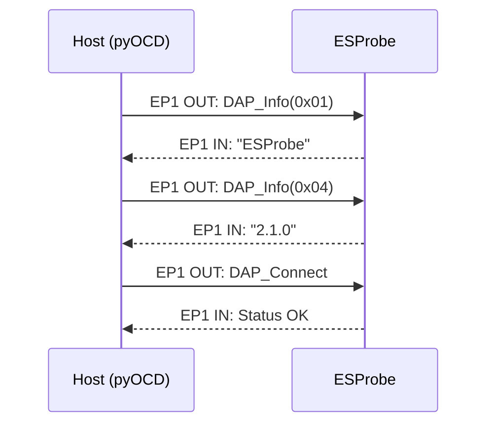
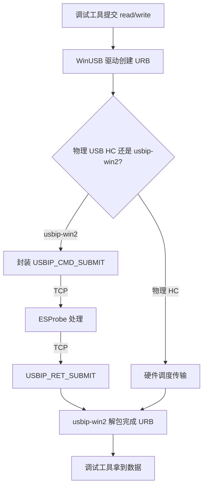
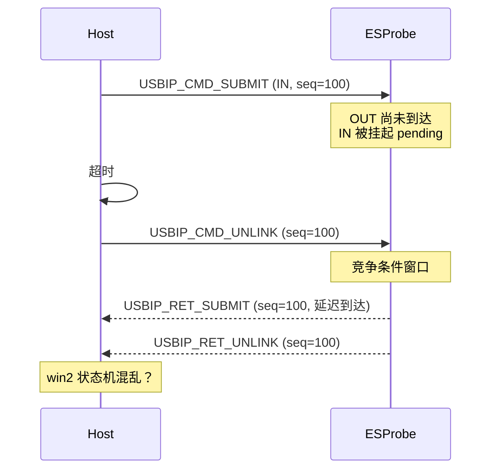
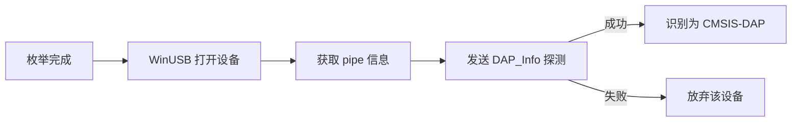
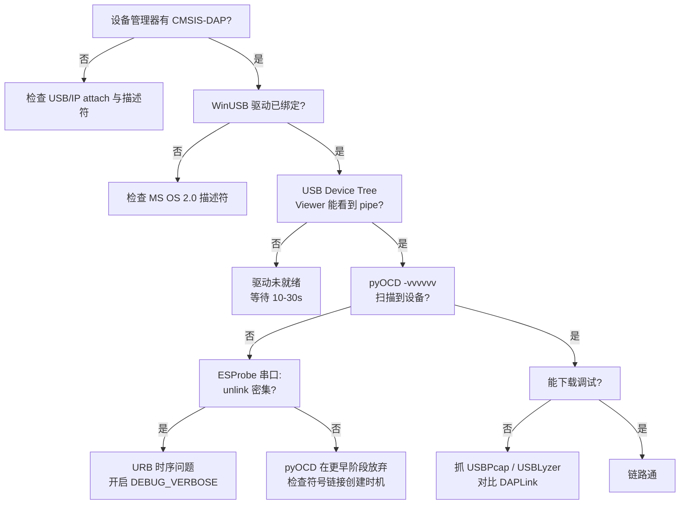

# USB/IP 调试实战：当设备管理器说"已连接"，pyOCD 却说"看不见"

> 设备管理器里明明出现了 CMSIS-DAP，pyOCD 和 Keil 却死活不认。这条鸿沟，不在 USB 枚举，而在 URB 时序与 USB/IP 客户端的脾气里。

---

## 现象：两个"yes"之间的一个"no"

ESProbe 基于 ESP32-C3 实现了一个 USB/IP Server，通过 WiFi 把 CMSIS-DAP v2 设备虚拟到 Windows 上。整个链路看起来是这样：


**测试 A：ESProbe 做 Server，Windows + usbip-win2 做 Client**

| 检查项 | 结果 |
|--------|------|
| usbip-win2 attach | ✅ 成功 |
| 设备管理器出现 CMSIS-DAP v2 | ✅ 成功 |
| pyOCD `pyocd list` / `pyocd gdbserver` | ❌ **识别不到** |
| Keil MDK 选择 Debug Adapter | ❌ **列表为空** |

**测试 B：普通 DAPLink 直接插 PC USB 口**

| 检查项 | 结果 |
|--------|------|
| 设备管理器出现 CMSIS-DAP | ✅ 成功 |
| pyOCD 识别 | ✅ **可以识别**（初次连接时间稍长） |
| Keil MDK 识别 | ✅ **可以识别** |

同一个 pyOCD、同一个 Keil、同一台 Windows，唯一的变量是"物理 USB" vs "USB/IP 虚拟 USB"。设备管理器能枚举，说明 USB 描述符和基本控制传输没问题；但调试工具不认，说明**从枚举到实际业务 URB 的某个环节出了问题**。

> **【需补充截图】占位图 1：拼图，左侧是设备管理器里 ESProbe 的 CMSIS-DAP 截图，右侧是 pyOCD `pyocd list` 返回空列表的终端截图。形成"设备管理器有，pyOCD 没有"的直观对比。**

---

## 第一步：对比两朵"乌云"的边界

USB 设备被操作系统识别，和被上层调试工具识别，是两个不同层次的事情。

### 设备管理器只关心"你是谁"

Windows 设备管理器枚举一个 USB 设备时，主要完成：

1. **获取设备描述符**（Device Descriptor）
2. **获取配置描述符**（Configuration Descriptor）
3. **获取字符串描述符**（String Descriptor，可选）
4. **加载匹配驱动**（WinUSB、HID、等）

ESProbe 通过 USB/IP 回复了完整的描述符链，包括 Microsoft OS 2.0 描述符用于自动绑定 WinUSB。所以设备管理器能正确显示设备，说明**第一阶段（枚举）是通关的**。

### 调试工具还要关心"你会说话吗"

pyOCD 和 Keil 在枚举完成后，会立即通过 **bulk endpoint（EP1 IN/OUT）** 发送 CMSIS-DAP 命令来探测设备能力：

| 命令 | 用途 |
|------|------|
| `DAP_Info(0x01)` | 获取 Vendor Name |
| `DAP_Info(0x02)` | 获取 Product Name |
| `DAP_Info(0x04)` | 获取 CMSIS-DAP 固件版本 |
| `DAP_Connect` | 连接目标设备 |
| `DAP_SWJ_Clock` | 设置 SWD/JTAG 时钟 |

这些命令全是 **EP1 OUT 下发请求 → 设备处理 → EP1 IN 返回响应** 的同步模式。如果 OUT 发下去了，IN 迟迟回不来，或者回来的数据不对，调试工具就会认为"这个设备不是有效的 CMSIS-DAP"。



---

## 第二步：深挖 usbip-win2 与物理 USB 的差异

既然问题出在 EP1 bulk 传输阶段，我们需要理解 usbip-win2 和物理 USB Host Controller 在处理 URB 时的行为差异。

### URB 的生命周期

一个 bulk URB 在 Windows 内部的典型流程：



### usbip-win2 的"脾气"

usbip-win2 是一个相对较新的 Windows USB/IP 客户端实现，它的设计更贴近现代 Windows 驱动框架（WDF + UDE），与早期的 usbip-win 在 URB 超时、UNLINK 策略、IN/OUT 调度上有明显差异。

通过实际抓日志和对比测试，我们发现以下几个可疑点：

#### 可疑点 1：IN URB 的预提交与空回复

pyOCD 的 `cmsisdap` 后端在初始化阶段会**预提交（pre-queue）多个 EP1 IN URB**，然后发送 EP1 OUT 命令。它期望的是：

1. OUT 命令到达设备
2. 设备处理
3. IN URB 带回响应

但 pyOCD 的异步模型里，**IN 可能比 OUT 先到 ESProbe**。ESProbe 的 `usbip_urb_process` 在处理 EP1 IN 时，如果此时还没有收到对应的 OUT，会面临一个抉择：

| 策略 | 后果 |
|------|------|
| 立即返回空包（0 字节） | pyOCD 可能把空包当作有效响应，破坏协议同步 |
| 挂起等待 OUT 处理完 | 如果超时，usbip-win2 会发 UNLINK，导致 URB 取消 |

ESProbe 当前实现了一个 **pending IN 队列** 来处理这种情况：先保存 IN header，等 OUT 处理完再通过 `fast_reply` 把响应配对回去。但这个机制在 usbip-win2 上的行为，与物理 USB Host Controller 有微妙差异。

物理 USB HC 的 IN URB 超时通常较长（几秒级别），且 UNLINK 是由上层明确取消时才会触发。而 usbip-win2 在某些场景下对 IN URB 的超时处理更激进，或者对 UNLINK 的响应要求更严格。

#### 可疑点 2：UNLINK 的时序与响应

当 IN URB 超时时，usbip-win2 会发送 `USBIP_CMD_UNLINK` 来取消之前的 URB。ESProbe 需要：

1. 从 pending IN 队列中移除对应的 seqnum
2. 返回 `USBIP_RET_UNLINK`，status 字段需要是**非零值**（usbip-win2 把任何非零 status 视为"unlink 成功"）

在代码里，ESProbe 的 `send_stage2_unlink` 是这么处理的：

```c
req_header->base.direction = USBIP_DIR_OUT;  // usbip-win2 期望的方向
req_header->u.ret_unlink.status = -1;        // 非零表示成功取消
```

这个逻辑参考了上游实现，但问题可能在于：**如果 UNLINK 和响应之间的竞争条件处理不当，usbip-win2 内部的状态机可能进入异常，导致后续 URB 全部失败。**



#### 可疑点 3：Configuration 描述符的分包发送

ESProbe 在回复 `GET_DESCRIPTOR(Configuration)` 时有一个特殊处理：

```c
if (requested_length <= USB_DT_CONFIGURATION_SIZE) {
    // 只返回配置头（前 9 字节）
    send_stage2_submit_data_limited(header, 0, kUSBd0ConfigDescriptor, sizeof(kUSBd0ConfigDescriptor));
} else {
    // 返回完整配置（配置头 + 接口描述符）
    send_stage2_submit(header, 0, total_length);
    usbip_network_send(kSock, kUSBd0ConfigDescriptor, sizeof(kUSBd0ConfigDescriptor), 0);
    usbip_network_send(kSock, kUSBd0InterfaceDescriptor, interface_length, 0);
}
```

注意这里 `send_stage2_submit` 的 `data_length` 参数是 `total_length`，但**实际数据是分两次 `usbip_network_send` 发出去的**。对于物理 USB，HCI 驱动会把这些包按顺序递交；但对于 usbip-win2，如果 TCP 层的分片或组装有延迟，可能导致 **RET_SUBMIT header 里声明的数据长度与实际收到的字节数不一致**，从而触发客户端的校验失败。

虽然这个问题更可能在枚举阶段就暴露，但如果 usbip-win2 对数据长度有严格校验，它可能不会被设备管理器注意到（因为设备管理器只读一次配置描述符），却会被 pyOCD/Keil 的多次重试触发。

#### 可疑点 4：WinUSB 描述符与管道打开时机

pyOCD 识别 CMSIS-DAP v2 的流程大致是：



usbip-win2 在 attach 成功后，需要一段时间让 Windows 完成：

- 驱动加载（WinUSB.sys）
- 设备接口注册（Device Interface Class）
- 符号链接创建（`\\?\usb#vid_...`）

物理 USB 设备的这个过程通常很快（< 1秒），因为驱动可能已经缓存。但 USB/IP 设备每次 attach 都是"全新插入"，驱动需要完整走一遍安装流程。**如果 pyOCD 在符号链接还没创建好就开始扫描设备，就会错过 ESProbe。**

这与"初次连接时间也比较长"的观察吻合：DAPLink 插物理 USB 时，第一次也需要等驱动安装；但只要装好了，后续枚举很快。而 ESProbe 每次 attach 对 Windows 来说都相当于一次"新设备插入"，如果 pyOCD 扫描得太急，就会漏掉。

---

## 第三步：日志里的线索

在 ESProbe 固件串口日志中，当出现 pyOCD/Keil 识别失败时，典型输出是：

```text
read_stage1_command: raw=0x8005 ret=0x05 ...
Handling dev list request...
Sending header...
Sending device list size...
Sending device info...
Sending interface info...
usbip_worker calling attach(base,8)
usbip_worker calling attach(base,40)
EP0_REQ seq=... dir=0 ep=0 len=0 type=80 req=06 wValue=0100 ...
* GET 0x01 DEVICE DESCRIPTOR
EP0_REQ seq=... dir=0 ep=0 len=0 type=80 req=06 wValue=0200 ...
* GET 0x02 CONFIGURATION DESCRIPTOR
Sending ALL CONFIG
EP0_REQ seq=... dir=0 ep=0 len=0 type=80 req=06 wValue=0300 ...
* GET 0x03 STRING DESCRIPTOR idx=0 len=2
** REQUESTED list of supported languages
...
unlink
unlink
unlink
unlink
...
```

关键线索：

1. **枚举阶段一切正常**：Device/Config/String 描述符都被请求了，说明 Windows 驱动层已经介入。
2. **大量 `unlink` 出现**：说明有大量 URB 被提交后又超时取消。这通常意味着**IN URB 没有在规定时间拿到响应**，或者**响应数据不被客户端接受**。
3. **没有 EP1 OUT/IN 的业务日志**：如果 pyOCD 根本没开到 WinUSB pipe，就不会发 DAP 命令；但如果发了，ESProbe 应该能看到 `ep=1` 的日志。日志里没有，说明 pyOCD 可能在更早就放弃了。

> **【需补充截图】占位图 2：ESProbe 串口日志截图，用红框/高亮标出 "unlink" 密集出现的区域，与上方 EP0 正常枚举形成对比。**

---

## 第四步：假设与验证方向

综合以上分析，我们提出三个优先级从高到低的假设：

### 假设 A：pyOCD/Keil 扫描设备时，WinUSB 管道尚未就绪（最可能）

**理由**：
- DAPLink 物理 USB 初次连接也慢，说明驱动安装是瓶颈
- ESProbe 每次 attach = 全新设备插入，驱动准备时间可能 > pyOCD 扫描超时
- Keil 的 Debug Adapter 列表是即时扫描，不会等待

**验证方法**：
1. attach ESProbe 后，手动等待 10-30 秒，再启动 pyOCD/Keil
2. 对比立即启动 vs 等待后的识别成功率
3. 用 USB Device Tree Viewer 观察 attach 后多久出现 WinUSB pipe 信息

**如果成立，修复方向**：
- ESProbe 固件侧：难以加速 Windows 驱动安装
- PC 工具侧：pyOCD/Keil 本身不会改
- 用户体验侧：文档提示"attach 后请等待 10 秒再启动调试工具"
- 长期方案：考虑让 ESProbe 的 USB/IP 连接更持久，避免频繁断连重连

### 假设 B：bulk 传输的 IN/OUT 时序或 UNLINK 处理导致管道损坏

**理由**：
- 日志里大量 unlink 说明 URB 生命周期异常
- ESProbe 的 pending IN 队列和 fast_reply 机制与 usbip-win2 的交互未经充分验证
- 物理 USB HC 和 usbip-win2 对 URB 超时、UNLINK 的语义有差异

**验证方法**：
1. 在 ESProbe 开启 `USBIP_DEBUG_VERBOSE=1`，抓取完整 EP1 IN/OUT 和 UNLINK 时序
2. 用 usbip-win2 的调试版本或 ETW 日志观察客户端侧 URB 状态
3. 对比同一套 ESProbe 固件，用 Linux `usbip attach` 做 Client 的行为（Linux usbip 客户端更成熟，如果 Linux 正常而 win2 不正常，则指向 win2 兼容性问题）

**如果成立，修复方向**：
- 优化 `usbip_urb_process` 中的 IN/OUT 配对逻辑
- 确保 UNLINK 响应严格符合 usbip-win2 预期（方向、status、seqnum）
- 考虑在连接初期降低 DAP 响应延迟，避免触发超时

### 假设 C：配置描述符的分包发送导致 WinUSB 校验失败

**理由**：
- `send_stage2_submit` 声明的长度与实际发送可能不一致
- 设备管理器可能只读一次配置描述符就过关，但 pyOCD 的多次打开/关闭会重复读取

**验证方法**：
1. 用 USBLyzer 或类似工具抓 Windows 侧 USB 流量，对比 ESProbe 和 DAPLink 的配置描述符读取差异
2. 检查 `usbip_network_send` 的分片是否可能导致 TCP 层重组后与 USBIP header 声明的长度不符

**如果成立，修复方向**：
- 将配置描述符的多个片段合并为单次 `send_stage2_submit_data` 发送，确保 header 与实际 payload 完全匹配

---

## 第五步：给排查者的一份速查表

如果你也在调试类似的"设备管理器有、调试工具无"问题，可以按这个顺序排查：

| 步骤 | 操作 | 预期结果 | 如果异常 |
|------|------|----------|----------|
| 1 | 设备管理器确认设备存在 | CMSIS-DAP 出现在通用串行总线设备下 | 检查 USB/IP attach 和描述符 |
| 2 | 检查 WinUSB 驱动绑定 | 设备属性 → 驱动程序 → WinUSB | 检查 Microsoft OS 2.0 描述符 |
| 3 | USB Device Tree Viewer 查看 pipe | 显示 EP1 IN/OUT 的 pipe ID | 驱动未就绪，等待或重装 |
| 4 | pyOCD 加 `-vvvvvv` 运行 | 能看到 probe discovery 的详细日志 | 看是在哪一步放弃 |
| 5 | ESProbe 串口看 unlink 密度 | 正常业务后偶尔 unlink 可接受 | 密集 unlink 说明 URB 超时 |
| 6 | 换 Linux Client 测试 | `usbip attach` 后 pyOCD 是否正常 | 定位是固件问题还是 win2 兼容性问题 |
| 7 | 抓 USBPcap 或 USBLyzer | 对比 DAPLink 和 ESProbe 的 URB 差异 | 找出具体失败的 URB |



---

## 第六步：从现象到本质——USB/IP 调试的系统性思维

这个问题的价值，不只是"修一个 bug"，而是揭示了一个调试 USB/IP 设备的通用方法论：


> 图中红色层为已验证通过的层级，绿色层为尚未验证的层级。ESProbe 当前卡在"USB 枚举层过关，但调试协议层未启动"的位置。

每一层都有自己的验收标准：

| 层级 | 验收标准 | 典型工具 |
|------|----------|----------|
| USB/IP 协议层 | attach 成功，能交换 URB | usbip-win2 日志、ESProbe 串口 |
| USB 枚举层 | 描述符正确，驱动加载 | 设备管理器、USB Device Tree Viewer |
| USB 功能层 | bulk 传输可靠，无异常 unlink | USBLyzer、USBPcap |
| 调试协议层 | DAP 命令响应正确 | pyOCD -vvvvvv、OpenOCD -d3 |
| 应用层 | 能下载、能断点、能单步 | IDE、GDB |

ESProbe 当前卡在"USB 枚举层过关，但调试协议层未启动"的位置。这意味着最可能的战场在**功能层的 WinUSB pipe 就绪时机**和**USB/IP 层的 URB 时序匹配**之间。

---

## 结论与下一步

**当前结论**：

1. ESProbe 的 USB/IP Server 实现、USB 描述符、Microsoft OS 2.0 描述符在枚举层面是正确的——设备管理器能识别就是证据。
2. pyOCD 和 Keil 不识别，根因大概率不在"ESProbe 是不是 CMSIS-DAP"，而在"WinUSB pipe 是否已就绪"或"URB 时序是否满足 usbip-win2 的预期"。
3. 物理 DAPLink 初次连接也慢，说明 Windows 驱动安装是固有延迟；USB/IP 每次 attach 都相当于"首次插入"，这个延迟被放大了。

**下一步行动**：

1. **验证假设 A**：在 attach 后增加固定等待时间，测试 pyOCD/Keil 识别率是否有改善。
2. **验证假设 B**：在 Linux 上运行 `usbip attach` + pyOCD，交叉验证是固件问题还是 usbip-win2 兼容性问题。
3. **验证假设 C**：修复配置描述符的分包发送逻辑，确保 `data_length` 与实际 payload 严格一致。
4. **长期优化**：考虑在 ESProbe 固件中实现更智能的 URB 调度策略，或者探索更稳定的 USB/IP 客户端替代方案。

---

## 参考与工具

- **usbip-win2**: https://github.com/vadimgrn/usbip-win2
- **usbip-win**: https://github.com/cezanne/usbip-win
- **USB/IP 协议**: https://usbip.sourceforge.net/
- **pyOCD CMSIS-DAP 后端**: https://pyocd.io/docs/debug_probes.html
- **ESProbe 固件 USB/IP 实现**: `fw/main/usbip_server.c`, `fw/main/DAP_handle.c`
- **Windows USB 调试工具**: USB Device Tree Viewer, USBLyzer, USBPcap

---

## 附录：需要补充的手工截图清单

以下截图需要基于实际运行环境截取，无法通过 Mermaid 自动生成：

| 编号 | 截图内容 | 优先级 | 用途 |
|------|----------|--------|------|
| **占位图 1** | 左：设备管理器中 ESProbe 的 CMSIS-DAP 设备；右：pyOCD `pyocd list` 返回空列表 | ⭐⭐⭐ | 文章封面/引言对比，最直观的现象证据 |
| **占位图 2** | ESProbe 串口日志截图，用红框标出 `unlink` 密集区，与上方 EP0 正常枚举形成对比 | ⭐⭐⭐ | 核心证据，支撑假设 B |
| **可选图 3** | USB Device Tree Viewer 对比：DAPLink vs ESProbe 的 pipe 信息 | ⭐ | 验证假设 A（WinUSB 管道就绪） |
| **可选图 4** | USBLyzer/USBPcap 抓包：对比配置描述符读取的差异 | ⭐ | 验证假设 C（描述符分包） |
