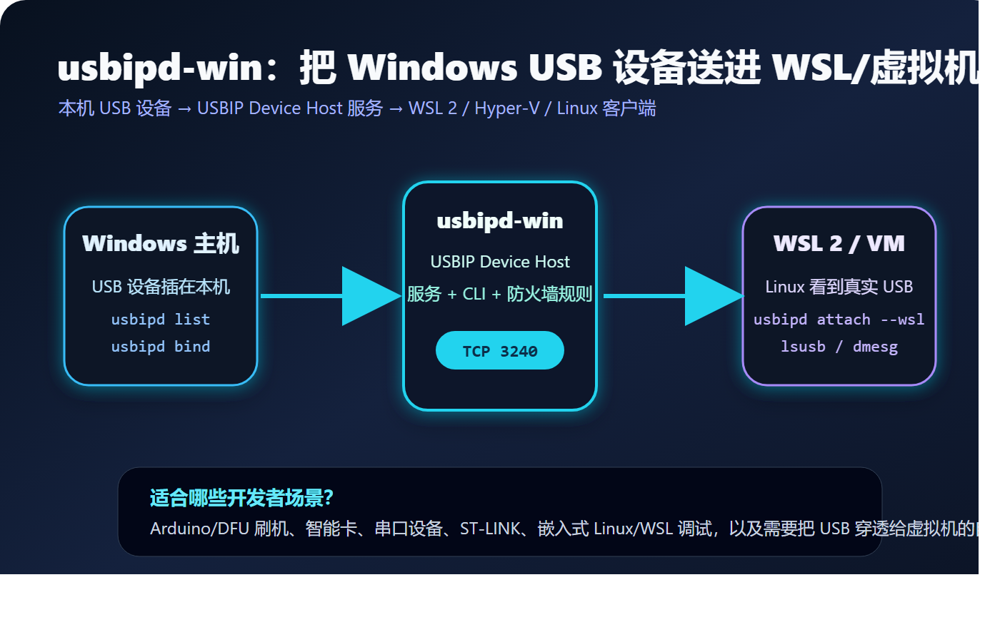

# usbipd-win：为什么 WSL 开发者都应该认识它

很多嵌入式开发者在 Windows 上都会遇到一个尴尬场景：

IDE、串口工具、厂家下载器在 Windows；Linux 编译链、脚本、OpenOCD、容器环境在 WSL；真正的 USB 设备却只能插在一边。

`usbipd-win` 解决的就是这个边界问题。它让插在 Windows 主机上的 USB 设备，通过 USB/IP 共享给 WSL 2、Hyper-V 虚拟机或其他 Linux 客户端。

如果前一篇文章讲的是“Windows 如何挂载远端 USB/IP 设备”，那么 `usbipd-win` 更像反方向：Windows 把本机 USB 设备共享出去。



## 它和 usbip-win、usbip-win2 有什么不同

三个名字很像，但定位不同：

| 项目 | 主要方向 | 典型场景 |
| --- | --- | --- |
| usbip-win | Windows USB/IP server + client 早期实现 | 研究完整 USB/IP Windows 支撑 |
| usbip-win2 | Windows USB/IP client | Windows 连接远端 USB/IP server |
| usbipd-win | Windows USB/IP host/server | Windows 把本机 USB 设备共享给 WSL/VM |

也就是说，`usbipd-win` 的核心身份是 Windows 侧的 USBIP Device Host。

它安装后会提供：

- 一个名为 `usbipd` 的 Windows 服务。
- 一个命令行工具 `usbipd`。
- 一个允许本地子网访问服务的防火墙规则。

这让它非常适合 WSL 2：Windows 负责接入真实 USB 设备，WSL 通过 USB/IP 使用这些设备。

## 一个典型工作流

安装可以使用 MSI，也可以通过 Windows Package Manager：

```powershell
winget install --interactive --exact dorssel.usbipd-win
```

然后以管理员 PowerShell 查看设备：

```powershell
usbipd list
```

找到目标设备的 `BUSID` 后，先共享设备：

```powershell
usbipd bind --busid 4-4
```

再用普通权限把设备附加到 WSL：

```powershell
usbipd attach --wsl --busid 4-4
```

进入 WSL 后，可以用 Linux 工具确认：

```bash
lsusb
dmesg | tail
```

这时，设备对 WSL 来说就像插在 Linux 主机上一样。Arduino、DFU、ST-LINK、USB 串口、智能卡读卡器等开发场景，都可以因此进入 WSL 工作流。

## 为什么它对嵌入式开发很有用

WSL 让 Windows 用户拥有了接近 Linux 的开发体验，但 USB 一直是嵌入式开发里的关键短板。

嵌入式开发不是纯软件开发。它需要：

- 通过 USB 串口看日志。
- 通过 DFU 或 Bootloader 下载固件。
- 通过 ST-LINK、J-Link、CMSIS-DAP 调试芯片。
- 通过厂商工具或开源脚本访问 USB 设备。

`usbipd-win` 把这些设备带进 WSL 后，Linux 侧的工具链就能真正参与硬件调试，而不是只能编译代码。

## 和 ESProbe 的关系

ESProbe 的主路径是：

```text
ESProbe 作为 USB/IP server
Windows 作为 USB/IP client
Windows IDE 使用 CMSIS-DAP
```

而 `usbipd-win` 的主路径是：

```text
Windows 本机 USB 设备
usbipd-win 共享
WSL / VM 作为 USB/IP client
Linux 工具使用设备
```

方向相反，但思想一致：都在用 USB/IP 把 USB 设备从物理插拔位置中解放出来。

这也给 ESProbe 项目一个重要参考：好的 USB/IP 工具不只是“协议跑通”，还要让用户能用清晰命令完成发现、共享、附加、验证、释放。

## 使用时要注意什么

第一，USB 设备附加到 WSL 后，Windows 侧通常不能同时使用它。它更像是“借给了 WSL”。

第二，`bind` 通常需要管理员权限，而 `attach --wsl` 可以在普通权限下执行。这种权限分层能降低日常使用成本。

第三，WSL 内核需要支持 USB/IP 和对应设备驱动。如果设备在 `lsusb` 中可见，但应用不可用，就要继续检查 Linux 驱动、udev 权限或内核模块。

第四，USB/IP 经过网络/虚拟化层，不适合所有对时延极端敏感的设备。调试器、串口、刷机工具通常有机会工作良好，但高速等时传输设备要谨慎评估。

## 结语

`usbipd-win` 最有价值的地方，是把 Windows 和 Linux 开发环境之间那条看不见的 USB 边界打通了。

对普通开发者，它让 WSL 真正接近一台可操作硬件的 Linux 主机。

对 ESProbe 这样的项目，它提供了一个成熟参照：当 USB 设备开始在网络中流动，工具链、驱动、权限和用户体验必须一起设计。

## 参考资料

- usbipd-win: https://github.com/dorssel/usbipd-win
- Microsoft Learn：连接 USB 设备到 WSL: https://learn.microsoft.com/zh-cn/windows/wsl/connect-usb
- Windows Command Line Blog：Connecting USB devices to WSL: https://devblogs.microsoft.com/commandline/connecting-usb-devices-to-wsl/
